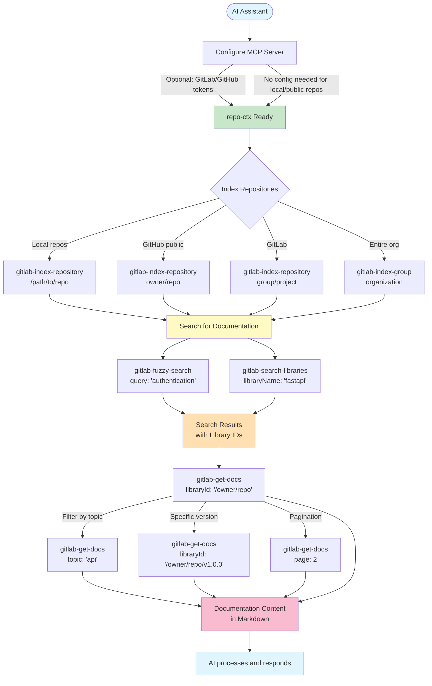
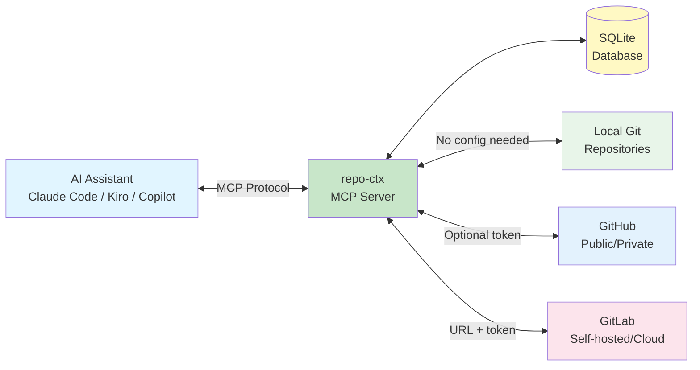

# Repository Context (`repo-ctx`)

A flexible Git repository documentation indexer and search tool with multiple interfaces:
- **MCP Server** for LLM integration (primary use case)
- **CLI** for standalone searching
- **Python library** for custom integrations

Supports **GitLab**, **GitHub**, and **local Git repositories** (including Enterprise versions) with auto-detection and explicit provider selection.

## Features

- **Multi-provider support** - Index from GitLab, GitHub, and local Git repositories
- **Local repository indexing** - Index local repos without network access (offline work)
- **GitHub public repos** - Works without authentication (with rate limits)
- **Smart authentication fallback** - Falls back to unauthenticated access if token is invalid
- Search repositories by name with fuzzy matching
- Retrieve documentation with topic filtering
- Support for multiple versions (tags/branches)
- Configurable via `.repo-ctx.json` or `git_context.json` in repositories
- SQLite storage for fast local access
- MCP protocol for seamless LLM integration
- Works with Claude Code, Kiro CLI, GitHub Copilot, and other AI tools
- Use as a Python library in your own tools
- Auto-detect provider from repository path format

## Installation

### From PyPI (Recommended)

```bash
uvx repo-ctx
```

### From Source

```bash
cd repo-ctx
uv pip install -e .
```

## MCP Tools Overview

repo-ctx provides **5 MCP tools** for seamless integration with AI assistants like Claude Code, Kiro CLI, and GitHub Copilot.

### Workflow Diagram



### Available Tools

| Tool | Purpose | Example |
|------|---------|---------|
| **gitlab-index-repository** | Index a single repository | Index `fastapi/fastapi` from GitHub |
| **gitlab-index-group** | Index entire organization/group | Index all repos in `microsoft` org |
| **gitlab-fuzzy-search** | Search with typo tolerance | Search `"fasapi"` → finds `"fastapi"` |
| **gitlab-search-libraries** | Exact name search | Search for `"fastapi"` library |
| **gitlab-get-docs** | Retrieve documentation | Get docs for `/fastapi/fastapi` |

**📚 Complete Tool Reference:** See [MCP Tools Reference](docs/mcp_tools_reference.md) for detailed parameters, examples, and best practices.

### Quick MCP Examples

**Index a local repository:**
```javascript
await use_mcp_tool("repo-ctx", "gitlab-index-repository", {
  repository: "/home/user/projects/my-app"
});
```

**Index a GitHub public repo (no token needed):**
```javascript
await use_mcp_tool("repo-ctx", "gitlab-index-repository", {
  repository: "fastapi/fastapi"
});
```

**Search for documentation:**
```javascript
const results = await use_mcp_tool("repo-ctx", "gitlab-fuzzy-search", {
  query: "authentication",
  limit: 5
});
// Returns: Library IDs like /mygroup/auth-service
```

**Retrieve documentation:**
```javascript
const docs = await use_mcp_tool("repo-ctx", "gitlab-get-docs", {
  libraryId: "/mygroup/auth-service",
  topic: "api"  // Optional: filter by topic
});
```

## Configuration

repo-ctx supports GitLab, GitHub (including Enterprise), and local Git repositories.

**Configuration is optional** for:
- Local Git repositories (no network access needed)
- GitHub public repositories (rate-limited to 60 requests/hour)

**Configuration required** for:
- GitLab repositories (requires URL and token)
- GitHub private repositories or higher rate limits (5000/hour)

Configure providers using (in priority order):

1. **Command-line arguments** (`--gitlab-url`, `--gitlab-token`, `--github-token`, `--provider`)
2. **Specified config file** (`--config /path/to/config.yaml`)
3. **Environment variables** (`GITLAB_URL`, `GITLAB_TOKEN`, `GITHUB_TOKEN`)
4. **Standard config locations**:
   - `~/.config/repo-ctx/config.yaml`
   - `~/.repo-ctx/config.yaml`
   - `./config.yaml` (current directory)

**📚 Complete Guide:** See [Multi-Provider Support Guide](docs/multi-provider-guide.md) for detailed configuration options, examples, and troubleshooting.

### Quick Start: GitLab Only

```bash
export GITLAB_URL="https://gitlab.company.internal"
export GITLAB_TOKEN="glpat-your-token-here"

uvx repo-ctx --index group/project
```

### Quick Start: Local Repositories

```bash
# No configuration needed!
uvx repo-ctx --index /path/to/local/repo --provider local

# Or use auto-detection (absolute, relative, or ~ paths)
uvx repo-ctx --index ~/projects/my-repo
uvx repo-ctx --index ./my-repo
uvx repo-ctx --index /home/user/repos/project
```

### Quick Start: GitHub Only

```bash
# Public repos (no token needed, subject to 60/hr rate limit)
uvx repo-ctx --index owner/repo

# Private repos or higher rate limits (5000/hr)
export GITHUB_TOKEN="ghp-your-token-here"
uvx repo-ctx --index owner/repo

# Invalid token? Automatic fallback to unauthenticated access for public repos
```

### Quick Start: Both Providers

```bash
export GITLAB_URL="https://gitlab.company.com"
export GITLAB_TOKEN="glpat-xxx"
export GITHUB_TOKEN="ghp-xxx"

# Auto-detect provider from path format
uvx repo-ctx --index owner/repo              # → GitHub (2 parts)
uvx repo-ctx --index group/subgroup/project  # → GitLab (3+ parts)

# Or explicitly specify provider
uvx repo-ctx --index owner/repo --provider github
uvx repo-ctx --index group/project --provider gitlab
```

### Config File (Both Providers)

Create `~/.config/repo-ctx/config.yaml`:

```yaml
gitlab:
  url: "https://gitlab.company.internal"
  token: "${GITLAB_TOKEN}"

github:
  url: "https://api.github.com"  # Optional, defaults to public GitHub
  token: "${GITHUB_TOKEN}"        # Optional for public repos

storage:
  path: "~/.repo-ctx/context.db"
```


## Usage

### As a Python Library

repo-ctx can be imported and used as a library in your own applications:

```python
import asyncio
from repo_ctx.config import Config
from repo_ctx.core import RepositoryContext

async def main():
    # Initialize (config is optional for local and GitHub public repos)
    config = Config.from_env()
    context = RepositoryContext(config)
    await context.init()

    # Index from local filesystem (no config needed)
    await context.index_repository("/home/user/projects/my-repo", "", provider_type="local")

    # Index from GitLab
    await context.index_repository("mygroup", "myproject", provider_type="gitlab")

    # Index from GitHub (works without token for public repos)
    await context.index_repository("fastapi", "fastapi", provider_type="github")

    # Search across all indexed repos (local + remote)
    results = await context.fuzzy_search_libraries("fastapi", limit=5)
    for result in results:
        print(f"{result.name} (score: {result.score})")

    # Get documentation (works for any indexed repo)
    docs = await context.get_documentation("/fastapi/fastapi")
    print(docs["content"][0]["text"])

asyncio.run(main())
```

**Note:** `RepositoryContext` is the new multi-provider class. `GitLabContext` is still available as a backward-compatible alias.

**📚 Library Documentation:**
- [Quickstart Guide](docs/library/quickstart.md) - Get started in 5 minutes
- [API Reference](docs/library/api-reference.md) - Complete API documentation
- [Examples](docs/library/examples.md) - Real-world usage examples
- [Architecture](docs/library/architecture.md) - How it works internally

### CLI Usage

#### Search for Repositories

```bash
# Fuzzy search (typo-tolerant)
uv run repo-ctx search "fastapi"

# Limit results
uv run repo-ctx search "python" --limit 5

# Search within specific repo
uv run repo-ctx search "api" --repo mygroup
```

#### List Indexed Repositories

```bash
# Detailed view (shows last indexed date)
uv run repo-ctx list

# Simple view (names only)
uv run repo-ctx list --format simple
```

**Example output:**
```
Indexed Repositories (4):

1. /home/user/projects/my-app
   Description: My Local Application
   Default version: main
   Last indexed: 2025-11-25 14:30:00 (2 hours ago)

2. mygroup/fastapi-project
   Description: FastAPI microservice for user authentication
   Default version: main
   Last indexed: 2025-11-23 14:30:00 (3 days ago)

3. owner/public-repo
   Description: Open source project
   Default version: main
   Last indexed: 2025-11-23 09:15:00 (3 days ago)

4. backend/api-server
   Description: Main API server
   Default version: main
   Last indexed: 2025-11-22 09:15:00 (4 days ago)
```

**Note:** Paths are cleaned (no trailing slashes), descriptions are stripped of HTML/markdown tags.

#### Get Documentation

```bash
# Get all documentation
uv run repo-ctx docs mygroup/project

# Filter by topic
uv run repo-ctx docs mygroup/project --topic api

# Get specific version
uv run repo-ctx docs mygroup/project/v1.0.0

# Pagination
uv run repo-ctx docs mygroup/project --page 2
```

#### Index a Repository

**Local Repository:**
```bash
# No configuration needed!
uvx repo-ctx --index /path/to/local/repo --provider local

# Auto-detect from path format (/, ./, ~/)
uvx repo-ctx --index ~/projects/my-repo
uvx repo-ctx --index ./relative/path/to/repo
```

**GitLab:**
```bash
export GITLAB_URL="https://gitlab.company.internal"
export GITLAB_TOKEN="your_token"
uvx repo-ctx --index group/project
```

**GitHub:**
```bash
# Public repo (no token needed)
uvx repo-ctx --index owner/repo

# Private repo or higher rate limits
export GITHUB_TOKEN="ghp-your-token"
uvx repo-ctx --index owner/repo --provider github
```

**With command-line arguments:**
```bash
# GitLab
uvx repo-ctx \
  --gitlab-url https://gitlab.company.internal \
  --gitlab-token glpat-your-token \
  --index group/subgroup/repository

# GitHub
uvx repo-ctx \
  --github-token ghp-your-token \
  --index owner/repo \
  --provider github
```

**From source:**
```bash
uv run repo-ctx --index group/subgroup/repository --provider gitlab
uv run repo-ctx --index owner/repo --provider github
```

**📚 More examples:** See [Multi-Provider Guide](docs/multi-provider-guide.md) for GitHub Enterprise, both providers simultaneously, and advanced usage.

### Run as MCP Server

#### With Claude Code / MCP Clients

**Option 1: Using uvx with environment variables (Simplest)**

Add to MCP settings (e.g., `~/.config/claude/mcp.json`):

```json
{
  "mcpServers": {
    "repo-ctx": {
      "command": "uvx",
      "args": ["repo-ctx"],
      "env": {
        "GITLAB_URL": "https://gitlab.company.internal",
        "GITLAB_TOKEN": "${GITLAB_TOKEN}",
        "GITHUB_TOKEN": "${GITHUB_TOKEN}"
      }
    }
  }
}
```

**Note:** Configure one or both providers. The example above shows both GitLab and GitHub configured.

**Option 2: Using uvx with config file**

```json
{
  "mcpServers": {
    "repo-ctx": {
      "command": "uvx",
      "args": [
        "repo-ctx",
        "--config",
        "/home/user/.config/repo-ctx/config.yaml"
      ]
    }
  }
}
```

**Option 3: From source (for development)**

```json
{
  "mcpServers": {
    "repo-ctx": {
      "command": "uv",
      "args": [
        "--directory",
        "/absolute/path/to/repo-ctx",
        "run",
        "repo-ctx"
      ],
      "env": {
        "GITLAB_URL": "https://gitlab.company.internal",
        "GITLAB_TOKEN": "${GITLAB_TOKEN}"
      }
    }
  }
}
```

#### With Kiro CLI

Add to `~/.config/kiro/mcp.json`:

```json
{
  "mcpServers": {
    "repo-ctx": {
      "command": "uvx",
      "args": ["repo-ctx"],
      "env": {
        "GITLAB_URL": "https://gitlab.company.internal",
        "GITLAB_TOKEN": "${GITLAB_TOKEN}"
      }
    }
  }
}
```

Then use:
```bash
kiro-cli chat
```

Ask questions like:
- "Search for python in GitLab"
- "Fuzzy search for fastmcp"
- "Get GitLab docs for /group1/subgroup1/repo1"
- "Show me documentation about vector search from GitLab repo group/subgroup/repository"

#### With GitHub Copilot (VS Code)

Add to `.vscode/mcp.json`:

```json
{
  "mcpServers": {
    "repo-ctx": {
      "command": "uvx",
      "args": ["repo-ctx"],
      "env": {
        "GITLAB_URL": "https://gitlab.company.internal",
        "GITLAB_TOKEN": "${GITLAB_TOKEN}"
      }
    }
  }
}
```

## Repository Configuration

Add a `git_context.json` file to your repository root to customize indexing:

```json
{
  "projectTitle": "API Documentation",
  "description": "Internal API documentation and guides",
  "folders": ["docs", "guides"],
  "excludeFolders": ["node_modules", "dist"],
  "excludeFiles": ["CHANGELOG.md"]
}
```

## MCP Tools Reference

For complete MCP tool documentation including workflow diagrams, examples, and best practices, see:

**📚 [MCP Tools Overview](#mcp-tools-overview)** - Quick start and workflow diagram above
**📚 [MCP Tools Reference Guide](docs/mcp_tools_reference.md)** - Complete reference with all parameters

**Quick Summary:**

| Tool | Purpose |
|------|---------|
| `gitlab-index-repository` | Index single repository (local, GitHub, GitLab) |
| `gitlab-index-group` | Index entire organization/group |
| `gitlab-fuzzy-search` | Search with typo tolerance |
| `gitlab-search-libraries` | Exact name search |
| `gitlab-get-docs` | Retrieve documentation content |

**Note:** Despite the `gitlab-` prefix, all tools support **local, GitHub, and GitLab** repositories.

## Architecture



**Key Features:**
- **Multi-provider support:** Index from local, GitHub, and GitLab simultaneously
- **Optional authentication:** Local and GitHub public repos work without configuration
- **Fast local storage:** SQLite database for quick searches
- **MCP protocol:** Standard interface for AI assistant integration

## Troubleshooting

**"Provider 'github' not configured" or "Provider 'gitlab' not configured"?**
- For **local repositories**: No config needed! Just use `--provider local`
- For **GitHub public repos**: No config needed! Remove `--provider` or use `--provider github`
- For **GitHub private repos**: Set `GITHUB_TOKEN` environment variable
- For **GitLab**: Set `GITLAB_URL` and `GITLAB_TOKEN` environment variables

**GitHub authentication failing?**
- **Invalid token**: Will automatically fall back to unauthenticated access for public repos
- **Rate limited (60/hr)**: Set valid `GITHUB_TOKEN` for 5000/hr rate limit
- Check token hasn't expired at https://github.com/settings/tokens

**Local repository indexing issues?**
- Ensure path points to a Git repository (contains `.git` directory)
- Use absolute paths or `~/` for home directory
- Check you have read access to the repository

**Configuration not found?**
- **Optional for:** Local repos, GitHub public repos
- **Required for:** GitLab (any), GitHub private repos
- Set environment variables: `export GITLAB_URL=... GITLAB_TOKEN=...`
- Or create config file at: `~/.config/repo-ctx/config.yaml`
- Or use CLI args: `--gitlab-url --gitlab-token --github-token`

**Server not starting?**
- Configuration is now optional for local and GitHub public repos
- Check configuration if using GitLab or GitHub private repos
- For uvx: Make sure environment variables are set in MCP config

**No results when searching?**
- Index the repository first: `uvx repo-ctx --index owner/repo`
- Check database exists: `ls ~/.repo-ctx/context.db`
- Verify you have access to the repository

**GitLab connection errors?**
- Verify token has `read_api` scope
- Check GitLab URL is accessible
- Ensure token hasn't expired
- Test connection: `curl -H "PRIVATE-TOKEN: $GITLAB_TOKEN" $GITLAB_URL/api/v4/user`

## Development

### Contributing

Contributions are welcome! See [CONTRIBUTING.md](CONTRIBUTING.md) for details on:
- Development setup
- Running tests
- Code style guidelines
- Pull request process

### Automated Releases

This project uses GitHub Actions for automated releases:

- **Tests** run on every PR and push to main
- **Publishing** is automated when version tags are pushed
- **GitHub Releases** are created automatically with changelogs
- **Issue labeling** happens automatically for referenced issues

See [docs/GITHUB_ACTIONS.md](docs/GITHUB_ACTIONS.md) for complete CI/CD documentation.

### Quick Release

```bash
# Update version in pyproject.toml, then:
git add pyproject.toml
git commit -m "Bump version to 0.1.2"
git tag v0.1.2
git push origin main && git push origin v0.1.2
```

GitHub Actions will automatically build, test, and publish to PyPI.

See [docs/RELEASE_GUIDE.md](docs/RELEASE_GUIDE.md) for detailed release instructions.

## Requirements

- Python 3.10+
- uv package manager

**For local repositories:**
- Git installed
- No network access required

**For GitLab:**
- GitLab server with API access
- Personal access token with `read_api` scope

**For GitHub:**
- Public repos: No authentication required (60 req/hr rate limit)
- Private repos: Personal access token (5000 req/hr rate limit)

