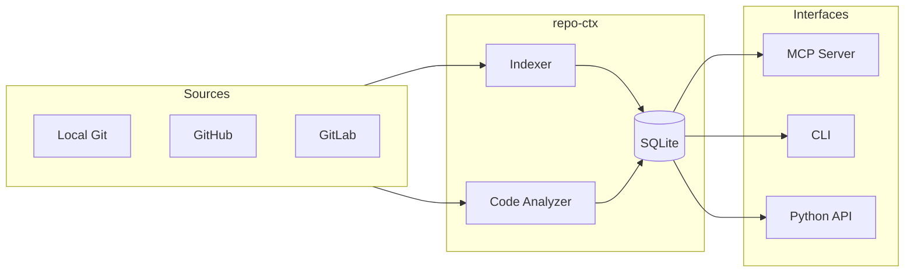

# repo-ctx

A Git repository documentation indexer and code analyzer for AI assistants and developers.

---

## Overview

repo-ctx indexes documentation and analyzes code from Git repositories, making them searchable and accessible via MCP (for AI assistants), CLI, or Python API.


```mermaid
flowchart LR
    subgraph Sources
        Local[Local Git]
        GitHub[GitHub]
        GitLab[GitLab]
    end

    subgraph repo-ctx
        Indexer[Indexer]
        Analyzer[Code Analyzer]
        Storage[(SQLite)]
    end

    subgraph Interfaces
        MCP[MCP Server]
        CLI[CLI]
        API[Python API]
    end

    Sources --> Indexer
    Sources --> Analyzer
    Indexer --> Storage
    Analyzer --> Storage
    Storage --> MCP
    Storage --> CLI
    Storage --> API
```

### Key Features

| Feature | Description |
|---------|-------------|
| Multi-provider | GitHub, GitLab, and local Git repositories |
| Documentation indexing | Full-text search across indexed repositories |
| Code analysis | Symbol extraction for 12 languages |
| Joern CPG | Advanced code property graph analysis (default) |
| Tree-sitter | Fast fallback analysis |
| Deep Code Analysis | Extracts docstrings and data flow dependencies |
| MCP integration | Works with Claude Code, Cursor, VS Code Copilot |

### Supported Languages

| Backend | Languages |
|---------|-----------|
| **Joern CPG** (default) | C, C++, Go, PHP, Ruby, Swift, C#, Python, Java, JavaScript, TypeScript, Kotlin |
| **Tree-sitter** (fallback) | Python, Java, JavaScript, TypeScript, Kotlin, Smalltalk |

Joern provides call graphs, data flow analysis, docstring extraction, and CPGQL queries. Tree-sitter is used when Joern is unavailable or explicitly requested. Smalltalk uses a custom parser for file-out format (Squeak/Pharo and VisualWorks dialects).

---

## Quick Start

```bash
# Install
pip install repo-ctx

# Index a repository
repo-ctx index /path/to/project          # Local
repo-ctx index fastapi/fastapi           # GitHub
repo-ctx index group/project             # GitLab
repo-ctx index --group myorg             # All repos in org

# Search and retrieve
repo-ctx search "fastapi"                # Search indexed repos
repo-ctx docs /fastapi/fastapi           # Get documentation

# Analyze code
repo-ctx analyze ./src                   # Extract symbols
repo-ctx search "UserService" -s ./src   # Find symbols locally
repo-ctx graph ./src                     # Dependency graph

# Check system status
repo-ctx status                          # Show capabilities
```

For AI assistant integration, see [MCP Setup](#mcp-setup) below.

---

## Installation

```bash
# PyPI
pip install repo-ctx

# Or run without installing
uvx repo-ctx --help
```

**Optional: Joern for extended analysis**

```bash
# Requires Java 19+
curl -L "https://github.com/joernio/joern/releases/latest/download/joern-install.sh" | bash
export PATH="$HOME/bin/joern:$PATH"
```

See [User Guide - Installation](docs/USER_GUIDE.md#installation) for detailed instructions.

---

## MCP Setup

Add to your MCP configuration (e.g., `~/.config/claude/mcp.json`):

```json
{
  "mcpServers": {
    "repo-ctx": {
      "command": "uvx",
      "args": ["repo-ctx", "-m"],
      "env": {
        "GITHUB_TOKEN": "${GITHUB_TOKEN}"
      }
    }
  }
}
```

No configuration needed for local repositories and public GitHub repos.

---

## Configuration

| Provider | Required Configuration |
|----------|----------------------|
| Local | None |
| GitHub (public) | None (60 req/hour) |
| GitHub (private) | `GITHUB_TOKEN` (5000 req/hour) |
| GitLab | `GITLAB_URL` + `GITLAB_TOKEN` |

```bash
export GITHUB_TOKEN="ghp_your_token"
export GITLAB_URL="https://gitlab.company.com"
export GITLAB_TOKEN="glpat-your_token"
```

---

## Documentation

| Document | Description |
|----------|-------------|
| **[User Guide](docs/USER_GUIDE.md)** | Usage, examples, best practices |
| **[Developer Guide](docs/DEV_GUIDE.md)** | Architecture, internals, contributing |
| [MCP Tools Reference](docs/mcp_tools_reference.md) | Complete MCP tool documentation |

---

## Project Status

repo-ctx is actively developed. For planned features and roadmap, see [BACKLOG.md](docs/BACKLOG.md).

---

## License

MIT License - see [LICENSE](LICENSE) for details.
