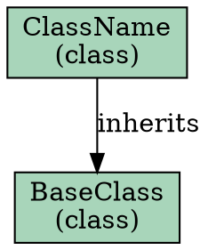

# Dependency Graph Documentation

Generate structured dependency graphs from code for LLM consumption and visualization.

## Overview

The dependency graph feature extracts relationships between code elements (files, classes, functions) and outputs them in standardized formats. This enables:

- **LLM Code Analysis:** Structured, deterministic context about code relationships
- **Architecture Visualization:** Export to DOT/GraphML for graph visualization tools
- **Code Navigation:** Understanding how components depend on each other
- **Refactoring Planning:** Identifying tightly coupled components

## Output Format

The primary output format is [JSON Graph Format (JGF)](https://jsongraphformat.info/), a standardized specification for representing graphs in JSON.

### Basic Structure

```json
{
  "graph": {
    "id": "/owner/repo",
    "type": "code-dependency-graph",
    "label": "Repository Dependency Graph",
    "directed": true,
    "metadata": {
      "generator": "repo-ctx",
      "version": "0.3.1",
      "generated_at": "2025-11-28T10:30:00Z",
      "graph_type": "class",
      "repository": {
        "id": "/owner/repo",
        "provider": "github"
      },
      "statistics": {
        "node_count": 15,
        "edge_count": 23,
        "max_depth": 3
      }
    },
    "nodes": {
      "module.ClassName": {
        "label": "ClassName",
        "metadata": {
          "type": "class",
          "file": "module.py",
          "line_start": 10,
          "line_end": 50,
          "language": "python",
          "visibility": "public",
          "signature": "class ClassName(BaseClass)"
        }
      }
    },
    "edges": [
      {
        "source": "module.ClassName",
        "target": "module.BaseClass",
        "relation": "inherits",
        "directed": true,
        "metadata": {
          "line": 10
        }
      }
    ]
  }
}
```

## Graph Types

| Type | Description | Nodes | Best For |
|------|-------------|-------|----------|
| `file` | File-level dependencies | Source files | Architecture overview |
| `module` | Module/package imports | Packages | Package structure |
| `class` | Class relationships | Classes, interfaces | OOP design |
| `function` | Function call graph | Functions, methods | Call flow analysis |
| `symbol` | All symbols | Everything | Complete analysis |

## Edge Relations

| Relation | Description | Example |
|----------|-------------|---------|
| `imports` | Module/file import | `import os` |
| `inherits` | Class inheritance | `class A(B)` |
| `implements` | Interface implementation | `class A implements B` |
| `contains` | Parent contains child | Class contains methods |
| `calls` | Function invocation | `foo()` calls `bar()` |
| `uses` | Type usage | Parameter types, return types |
| `instantiates` | Object creation | `obj = MyClass()` |

## CLI Usage

### Basic Commands

```bash
# Analyze local directory
repo-ctx code dep ./src

# Analyze indexed repository
repo-ctx code dep -r /owner/repo

# Specify output format
repo-ctx -o json code dep ./src
repo-ctx -o dot code dep ./src
repo-ctx -o graphml code dep ./src
```

### Options

| Option | Short | Description | Default |
|--------|-------|-------------|---------|
| `--type` | `-t` | Graph type (file/module/class/function/symbol) | `class` |
| `--depth` | `-d` | Maximum traversal depth | unlimited |
| `--repo` | `-r` | Treat path as indexed repository ID | false |

### Examples

```bash
# Class-level dependency graph
repo-ctx code dep ./src --type class

# Function call graph with depth limit
repo-ctx code dep ./src --type function --depth 3

# File dependencies for indexed repo
repo-ctx code dep -r /owner/repo --type file

# Export to DOT for visualization
repo-ctx -o dot code dep ./src > deps.dot
dot -Tpng deps.dot -o deps.png

# Export to GraphML
repo-ctx -o graphml code dep ./src > deps.graphml
```

## MCP Tool Usage

### Tool: `repo-ctx-dependency-graph`

```javascript
// Generate class dependency graph
await mcp.call("repo-ctx-dependency-graph", {
  path: "./src",
  graphType: "class",
  outputFormat: "json"
});

// Generate from indexed repository
await mcp.call("repo-ctx-dependency-graph", {
  repoId: "/owner/repo",
  graphType: "function",
  depth: 3,
  outputFormat: "json"
});
```

### Parameters

| Parameter | Type | Required | Description |
|-----------|------|----------|-------------|
| `path` | string | No* | Local path to analyze |
| `repoId` | string | No* | Indexed repository ID |
| `graphType` | string | No | Graph type (default: "class") |
| `depth` | integer | No | Max depth (default: unlimited) |
| `outputFormat` | string | No | Output format (default: "json") |

*Either `path` or `repoId` must be provided.

## Library API

```python
from repo_ctx.analysis import DependencyGraph, GraphType

# Create graph builder
graph = DependencyGraph()

# Build from symbols
symbols = analyzer.analyze_files(files)
dependencies = analyzer.extract_all_dependencies(files)

# Generate graph
result = graph.build(
    symbols=symbols,
    dependencies=dependencies,
    graph_type=GraphType.CLASS,
    max_depth=None
)

# Export to different formats
json_output = graph.to_json(result)
dot_output = graph.to_dot(result)
graphml_output = graph.to_graphml(result)
```

## Output Formats

### JSON (JGF)

Default format, optimized for LLM consumption.

```json
{
  "graph": {
    "nodes": { ... },
    "edges": [ ... ],
    "metadata": { ... }
  }
}
```

### DOT (GraphViz)

For visualization with GraphViz tools.



### GraphML

For tools like Gephi, yEd, Cytoscape.

```xml
<?xml version="1.0" encoding="UTF-8"?>
<graphml xmlns="http://graphml.graphdrawing.org/xmlns">
  <graph id="G" edgedefault="directed">
    <node id="ClassName">
      <data key="label">ClassName</data>
      <data key="type">class</data>
    </node>
    <edge source="ClassName" target="BaseClass">
      <data key="relation">inherits</data>
    </edge>
  </graph>
</graphml>
```

## Node Metadata

Each node contains rich metadata for context:

| Field | Type | Description |
|-------|------|-------------|
| `type` | string | Symbol type (class, function, etc.) |
| `file` | string | Source file path |
| `line_start` | int | Starting line number |
| `line_end` | int | Ending line number |
| `language` | string | Programming language |
| `visibility` | string | public/private/protected |
| `signature` | string | Code signature |
| `documentation` | string | Docstring or comments |
| `qualified_name` | string | Fully qualified name |
| `is_exported` | boolean | Whether symbol is exported |

## Use Cases

### 1. LLM Context Retrieval

Provide structured dependency information to LLMs:

```bash
repo-ctx -o json code dep -r /myorg/myrepo --type class | jq .
```

### 2. Architecture Documentation

Generate visual architecture diagrams:

```bash
repo-ctx -o dot code dep ./src --type file | dot -Tsvg -o architecture.svg
```

### 3. Impact Analysis

Find what depends on a specific component:

```bash
repo-ctx -o json code dep ./src --type class | \
  jq '.graph.edges[] | select(.target == "MyClass")'
```

### 4. Circular Dependency Detection

Analyze the graph for cycles (using external tools):

```bash
repo-ctx -o dot code dep ./src | \
  ccomps -x | dot -Tpng -o components.png
```

## Supported Languages

- Python
- JavaScript
- TypeScript
- Java
- Kotlin

## References

- [JSON Graph Format Specification](https://jsongraphformat.info/)
- [GraphViz DOT Language](https://graphviz.org/doc/info/lang.html)
- [GraphML Primer](http://graphml.graphdrawing.org/primer/graphml-primer.html)
- https://github.com/jsongraph/json-graph-specification
- https://www.marktechpost.com/2024/08/11/codexgraph-an-artificial-intelligence-ai-system-that-integrates-llm-agents-with-graph-database-interfaces-extracted-from-code-repositories/
- https://microsoft.github.io/language-server-protocol/specifications/lsif/0.6.0/specification/
- https://scribesecurity.com/blog/cyclonedx-sbom-dependency-graph/
- https://arxiv.org/html/2405.20455v3/