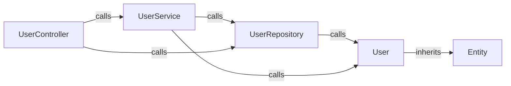
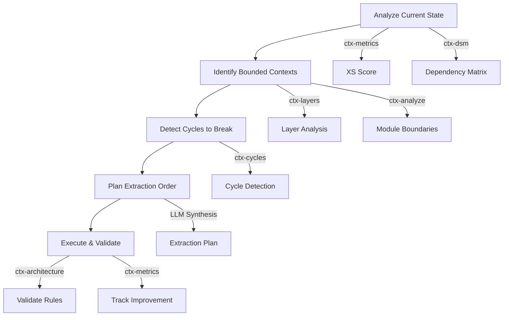
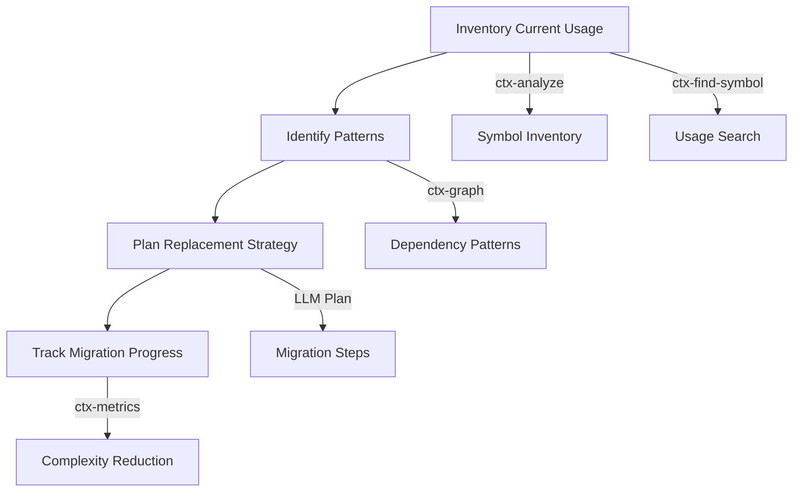
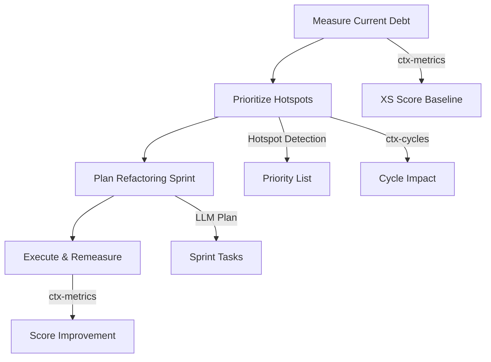

# Architecture Analysis Guide

This guide provides in-depth documentation of repo-ctx's architecture analysis capabilities, including algorithms, data structures, and practical examples.

---

## Table of Contents

1. [Overview](#overview)
2. [Use Cases](#use-cases)
3. [Dependency Structure Matrix (DSM)](#dependency-structure-matrix-dsm)
4. [Cycle Detection](#cycle-detection)
5. [Layer Detection](#layer-detection)
6. [Architecture Rules](#architecture-rules)
7. [Structural Metrics (XS)](#structural-metrics-xs)
8. [Hotspot Detection](#hotspot-detection)
9. [Dependency Graphs](#dependency-graphs)
10. [Implementation Reference](#implementation-reference)
11. [CLI and MCP Tools](#cli-and-mcp-tools)
12. [LLM Integration for Software Modernization](#llm-integration-for-software-modernization)
13. [Best Practices](#best-practices)

---

## Overview

repo-ctx provides comprehensive architecture analysis capabilities for understanding, visualizing, and enforcing code structure:

```
                     Dependency Graph
                           │
         ┌─────────────────┼─────────────────┐
         │                 │                 │
         ▼                 ▼                 ▼
   ┌─────────┐      ┌──────────┐      ┌─────────┐
   │   DSM   │      │  Cycles  │      │ Layers  │
   │ Matrix  │      │ Tangles  │      │ Detect  │
   └─────────┘      └──────────┘      └─────────┘
         │                 │                 │
         └─────────────────┼─────────────────┘
                           │
                           ▼
                  ┌─────────────────┐
                  │   Architecture  │
                  │      Rules      │
                  └─────────────────┘
                           │
                           ▼
                  ┌─────────────────┐
                  │    XS Metrics   │
                  │   & Hotspots    │
                  └─────────────────┘
```

### Analysis Types

| Analysis | Purpose | Use Case |
|----------|---------|----------|
| **DSM** | Visualize dependencies as matrix | Identify coupling patterns |
| **Cycles** | Detect cyclic dependencies | Find architectural tangles |
| **Layers** | Discover natural layering | Understand code structure |
| **Rules** | Enforce architecture | Prevent violations |
| **XS Metrics** | Quantify complexity | Track technical debt |
| **Hotspots** | Find problematic nodes | Prioritize refactoring |

---

## Use Cases

This section explains when to use each analysis tool and what problems they help solve.

### When to Use DSM

**Best for**: Understanding coupling patterns, visualizing dependencies, identifying clusters of tightly-coupled code.

| Scenario | DSM Helps By |
|----------|--------------|
| **"How tangled is this codebase?"** | Showing dependency density as a matrix - dense matrices = high coupling |
| **"Which modules are too interconnected?"** | Highlighting off-diagonal marks that indicate cross-module dependencies |
| **"Is this a layered architecture?"** | A triangular matrix indicates clean layers; scattered marks reveal violations |
| **"What will break if I change this?"** | Column shows what depends on a component; row shows what it depends on |
| **Code review / onboarding** | Quick visual overview of codebase structure |

**Example Use Case**: Before a major refactoring, generate a DSM to understand which components are tightly coupled. Target the densest areas first to reduce blast radius of changes.

```bash
repo-ctx dsm ./src --type module -f text
```

### When to Use Cycle Detection

**Best for**: Finding circular dependencies that prevent modularization, block independent testing, or cause maintenance nightmares.

| Scenario | Cycle Detection Helps By |
|----------|--------------------------|
| **"Why can't I test this module in isolation?"** | Cycles mean you can't test A without B and vice versa |
| **"Why does changing X break seemingly unrelated Y?"** | Cycles create hidden coupling paths |
| **"How do I split this monolith?"** | Cycles must be broken before modules can be extracted |
| **"Why is compilation so slow?"** | Cycles prevent incremental builds |
| **CI/CD pipeline failures** | Enforce no-new-cycles policy in CI |

**Example Use Case**: Your microservice extraction project is stuck because `services` and `repositories` have cycles. Use cycle detection to find the specific edges to break.

```bash
repo-ctx cycles ./src --type class -f json
```

### When to Use Layer Detection

**Best for**: Understanding implicit architecture, discovering natural boundaries, planning reorganization.

| Scenario | Layer Detection Helps By |
|----------|--------------------------|
| **"What's the structure of this inherited codebase?"** | Auto-discovers layers without needing documentation |
| **"Are we following our stated architecture?"** | Compares detected layers against documented design |
| **"How should I organize new code?"** | Shows where similar code naturally belongs |
| **"Which components are truly foundational?"** | Level-0 layers are depended on by everything |
| **"What's the dependency direction?"** | Higher layers depend on lower, never reverse |

**Example Use Case**: You joined a project with no architecture docs. Use layer detection to reverse-engineer the actual structure and understand the dependency hierarchy.

```bash
repo-ctx layers ./src --type module
```

### When to Use Architecture Rules

**Best for**: Enforcing architectural constraints, preventing drift, defining team standards.

| Scenario | Architecture Rules Help By |
|----------|---------------------------|
| **"Enforce Clean Architecture"** | Define layers and block upward dependencies |
| **"Prevent feature coupling"** | Forbid dependencies between feature modules |
| **"Legacy code migration"** | Gradually enforce new structure while allowing old |
| **"Team alignment"** | Document and automatically enforce architecture decisions |
| **"PR reviews"** | Catch violations before they merge |

**Example Use Case**: Your team agreed on Clean Architecture but violations keep appearing. Define rules in YAML and run in CI to catch violations early.

```bash
# architecture.yaml defines the rules
repo-ctx architecture ./src --rules architecture.yaml
```

### When to Use XS Metrics

**Best for**: Quantifying technical debt, tracking improvement over time, prioritizing refactoring efforts.

| Scenario | XS Metrics Help By |
|----------|-------------------|
| **"How bad is our technical debt?"** | Single score + grade for quick assessment |
| **"Is code quality improving or degrading?"** | Track XS score over commits/sprints |
| **"Where should we focus refactoring?"** | Breakdown shows cycles vs coupling vs violations |
| **"Justify refactoring to management"** | Quantifiable metrics instead of "feels bad" |
| **"Compare modules"** | Run on different directories to compare health |

**Example Use Case**: You're planning a refactoring sprint. Use XS metrics to identify which module has the worst score, then use the breakdown to understand why.

```bash
repo-ctx metrics ./src -r architecture.yaml -f json
```

### When to Use Hotspot Detection

**Best for**: Finding the most problematic components, prioritizing tactical fixes.

| Scenario | Hotspot Detection Helps By |
|----------|---------------------------|
| **"What's the riskiest part of the codebase?"** | High-severity hotspots = highest risk |
| **"Which class should I refactor first?"** | Hotspots sorted by severity |
| **"What's causing cascading failures?"** | Cycle participants often trigger ripple effects |
| **"God class detection"** | High coupling hotspots are often too-large classes |

**Example Use Case**: Your bug count is concentrated in certain areas. Use hotspot detection to see if those areas correlate with architectural problems.

```bash
repo-ctx metrics ./src | grep -A 10 "Hotspots"
```

### Decision Matrix

| I want to... | Use |
|--------------|-----|
| Get a visual overview of dependencies | **DSM** |
| Find and break circular dependencies | **Cycles** |
| Understand the layered structure | **Layers** |
| Enforce architectural rules in CI | **Architecture** |
| Quantify and track technical debt | **Metrics** |
| Find worst offenders to fix first | **Hotspots** |

### Combined Workflow

For comprehensive architecture analysis, use tools in this order:

1. **DSM** - Get the big picture
2. **Layers** - Understand the natural structure
3. **Cycles** - Identify critical problems
4. **Architecture** - Define and enforce rules
5. **Metrics** - Quantify and track progress

---

## Dependency Structure Matrix (DSM)

### Concept

A Dependency Structure Matrix (DSM) is a square matrix representation of dependencies where:
- Rows and columns represent code elements (classes, modules, files)
- Cell `(i, j)` indicates element `i` depends on element `j`
- A **triangular** (lower or upper) matrix indicates **no cycles** - clean layered architecture
- **Non-triangular** patterns reveal cyclic dependencies

### Example

Consider this code structure:

```
Controller → Service → Repository → Database
     ↓
   Utility
```

**DSM Representation:**

```
              Controller  Service  Repository  Database  Utility
Controller         .         1          0          0        1
Service            0         .          1          0        0
Repository         0         0          .          1        0
Database           0         0          0          .        0
Utility            0         0          0          0        .
```

Reading: "Controller depends on Service (1) and Utility (1)"

### With Cycles

If Repository also imports Controller (cycle):

```
              Controller  Service  Repository  Database  Utility
Controller         .         1          0          0        1
Service            0         .          1          0        0
Repository         1         0          .          1        0    ← Cycle!
Database           0         0          0          .        0
Utility            0         0          0          0        .
```

The `1` at (Repository, Controller) breaks the triangular pattern, indicating a cycle.

### Algorithm

```python
def build_dsm(graph):
    """Build DSM from dependency graph.

    1. Collect all nodes
    2. Sort nodes (optionally by layer/partitioning)
    3. Build NxN matrix
    4. For each edge (a → b): matrix[index(a)][index(b)] = 1
    5. Detect cycles via non-triangular cells
    """
    nodes = sorted(graph.nodes.keys())
    n = len(nodes)
    matrix = [[0] * n for _ in range(n)]
    node_index = {node: i for i, node in enumerate(nodes)}

    for edge in graph.edges:
        i = node_index[edge.source]
        j = node_index[edge.target]
        matrix[i][j] += 1  # Count dependencies

    return DSMResult(matrix, nodes)
```

**Complexity**: O(N + E) where N = nodes, E = edges

### CLI Usage

```bash
# Generate DSM for local code
repo-ctx dsm ./src --type class

# Output as JSON
repo-ctx dsm ./src -f json

# Different graph types
repo-ctx dsm ./src --type file
repo-ctx dsm ./src --type module
```

### Output Example

```
DSM: ./src (class graph)
Size: 5x5 | Cycles: 1

      Ctrl Svc  Repo DB   Util
Ctrl  .    1    0    0    1
Svc   0    .    1    0    0
Repo  1    0    .    1    0    ← Cycle indicator
DB    0    0    0    .    0
Util  0    0    0    0    .

Cycles detected in: Controller ↔ Repository
```

---

## Cycle Detection

### Concept

Cyclic dependencies (tangles) are a major source of architectural problems:
- Make code harder to understand
- Prevent independent testing
- Create ripple effects during changes
- Block modularization efforts

### Tarjan's Algorithm

We use **Tarjan's Strongly Connected Components (SCC)** algorithm to detect cycles:

```python
def tarjan_scc(graph):
    """Find all strongly connected components.

    A SCC with more than one node indicates a cycle.
    Time complexity: O(V + E)
    """
    index_counter = [0]
    stack = []
    lowlinks = {}
    index = {}
    on_stack = {}
    sccs = []

    def strongconnect(node):
        index[node] = index_counter[0]
        lowlinks[node] = index_counter[0]
        index_counter[0] += 1
        stack.append(node)
        on_stack[node] = True

        for neighbor in graph.neighbors(node):
            if neighbor not in index:
                strongconnect(neighbor)
                lowlinks[node] = min(lowlinks[node], lowlinks[neighbor])
            elif on_stack.get(neighbor, False):
                lowlinks[node] = min(lowlinks[node], index[neighbor])

        # If node is root of SCC
        if lowlinks[node] == index[node]:
            scc = []
            while True:
                w = stack.pop()
                on_stack[w] = False
                scc.append(w)
                if w == node:
                    break
            if len(scc) > 1:  # Cycle exists
                sccs.append(scc)

    for node in graph.nodes:
        if node not in index:
            strongconnect(node)

    return sccs
```

### Breakup Suggestions

For each cycle, we calculate which edge removal would have minimal impact:

```python
def suggest_breakup(cycle, graph):
    """Suggest edges to remove to break the cycle.

    Strategy: Find edge with lowest "impact score":
    - Impact = importance_of_source × importance_of_target
    - Importance = in_degree + out_degree (connectivity)

    Removing edges between less central nodes has less impact.
    """
    suggestions = []
    for edge in cycle.edges:
        source_importance = graph.degree(edge.source)
        target_importance = graph.degree(edge.target)
        impact = source_importance + target_importance

        suggestions.append(BreakupSuggestion(
            edge_to_remove=edge,
            impact_score=impact,
            reason=f"Remove {edge.source} → {edge.target}"
        ))

    return sorted(suggestions, key=lambda s: s.impact_score)
```

### CLI Usage

```bash
# Detect cycles
repo-ctx cycles ./src --type class

# JSON output with breakup suggestions
repo-ctx cycles ./src -f json
```

### Output Example

```
Cycle Detection: ./src

Found 2 cycles:

Cycle 1: (3 nodes, impact: 8.5)
  Nodes: Controller → Service → Repository → Controller
  Edges: 3
  Breakup suggestions:
    1. Remove Repository → Controller (lowest impact)
    2. Remove Service → Repository

Cycle 2: (2 nodes, impact: 4.0)
  Nodes: ModelA ↔ ModelB
  Edges: 2
  Breakup suggestions:
    1. Remove ModelB → ModelA
```

---

## Layer Detection

### Concept

Automatically discover the natural layering of code based on dependency patterns:
- **Bottom layers** (level 0): Nodes with no outgoing dependencies (providers)
- **Top layers** (higher levels): Nodes that depend on lower layers (consumers)
- Cycles are collapsed into single "super-nodes" before analysis

### Algorithm

```python
def detect_layers(graph):
    """Detect layers using topological analysis.

    1. Detect cycles and collapse into super-nodes
    2. Calculate level for each super-node:
       level(node) = max(level(dependencies)) + 1
       level(leaf) = 0
    3. Group nodes by level
    """
    # Step 1: Collapse cycles
    cycles = tarjan_scc(graph)
    super_nodes = collapse_cycles(graph, cycles)

    # Step 2: Calculate levels (reverse BFS)
    levels = {}

    def get_level(node, visited):
        if node in levels:
            return levels[node]
        if node in visited:
            return 0  # Cycle in super-graph (shouldn't happen)

        visited.add(node)
        max_dep_level = -1

        for dep in super_nodes.dependencies(node):
            dep_level = get_level(dep, visited)
            max_dep_level = max(max_dep_level, dep_level)

        levels[node] = max_dep_level + 1
        return levels[node]

    for node in super_nodes:
        get_level(node, set())

    # Step 3: Group by level
    layers = defaultdict(list)
    for node, level in levels.items():
        layers[level].extend(super_nodes.original_nodes(node))

    return [LayerInfo(f"Layer {l}", l, nodes)
            for l, nodes in sorted(layers.items())]
```

### Example

```
A → B → C → D
    ↓
    E → F

Detected Layers:
- Layer 0 (bottom): D, F  (no outgoing deps)
- Layer 1: C, E
- Layer 2: B
- Layer 3 (top): A
```

With a cycle B ↔ C, they collapse to same layer:
```
- Layer 0: D, F
- Layer 1: B, C, E  (B and C collapsed due to cycle)
- Layer 2: A
```

### CLI Usage

```bash
# Detect layers
repo-ctx layers ./src --type class

# JSON output
repo-ctx layers ./src -f json
```

### Output Example

```
Detected 4 layer(s) in ./src

Graph type: class
Total nodes: 42

Level 3: Layer 3
  Nodes (5): AppController, MainController, ApiController ...

Level 2: Layer 2
  Nodes (12): UserService, AuthService, DataService ...

Level 1: Layer 1
  Nodes (15): UserRepository, ConfigRepository ...

Level 0: Layer 0
  Nodes (10): DatabaseConnection, Logger, Constants ...
```

---

## Architecture Rules

### Concept

Define and enforce architectural constraints using a YAML-based DSL:
- **Layer rules**: Define which layers can depend on which
- **Forbidden rules**: Block specific dependency patterns
- **Allowed rules**: Exceptions to forbidden rules

### Rule Types

#### 1. Layer Ordering Rules

```yaml
layers:
  - name: presentation
    patterns: ["*.controller.*", "*.view.*"]
    above: business
  - name: business
    patterns: ["*.service.*", "*.usecase.*"]
    above: data
  - name: data
    patterns: ["*.repository.*", "*.dao.*"]
```

**Meaning**: `presentation` can depend on `business`, but `business` cannot depend on `presentation`.

#### 2. Forbidden Dependency Rules

```yaml
forbidden:
  - from: "*.controller.*"
    to: "*.repository.*"
    reason: "Controllers must not access repositories directly"
  - from: "*.data.*"
    to: "*.ui.*"
    reason: "Data layer must not depend on UI"
```

#### 3. Allowed Rules (Exceptions)

```yaml
allowed:
  - from: "*.service.*"
    to: "*.repository.*"
    reason: "Services can access repositories"
```

### Pattern Matching

Patterns support:
- **Exact match**: `"UserService"` matches node `UserService`
- **Wildcards**: `"*.service.*"` matches `com.app.service.UserService`
- **Prefix match**: `"ui"` matches `ui.View`, `ui.Controller`

### Violation Detection Algorithm

```python
def check_rules(graph, rules):
    """Check all rules against dependency graph.

    For each edge (source → target):
    1. Check forbidden rules: if matches both patterns → violation
    2. Check layer rules: if source in lower layer, target in upper → violation
    3. Check allowed rules: if explicitly allowed → skip violation
    """
    violations = []

    for edge in graph.edges:
        # Check forbidden rules
        for rule in rules.forbidden_rules:
            if matches(edge.source, rule.from_pattern) and \
               matches(edge.target, rule.to_pattern):
                if not is_explicitly_allowed(edge, rules):
                    violations.append(Violation(
                        rule_name="forbidden",
                        source=edge.source,
                        target=edge.target,
                        message=rule.reason
                    ))

        # Check layer rules
        for rule in rules.layer_rules:
            source_in_lower = matches(edge.source, rule.lower_layer)
            target_in_upper = matches(edge.target, rule.upper_layer)
            if source_in_lower and target_in_upper:
                violations.append(Violation(
                    rule_name="layer_order",
                    source=edge.source,
                    target=edge.target,
                    message=f"{rule.lower_layer} cannot depend on {rule.upper_layer}"
                ))

    return violations
```

### Complete Example

**Architecture Rules File** (`architecture.yaml`):

```yaml
name: "Clean Architecture"
description: "Layered architecture with strict boundaries"

layers:
  - name: ui
    patterns: ["*.ui.*", "*.view.*", "*.controller.*"]
    above: domain
  - name: domain
    patterns: ["*.domain.*", "*.service.*", "*.usecase.*"]
    above: data
  - name: data
    patterns: ["*.data.*", "*.repository.*", "*.dao.*"]

forbidden:
  - from: "*.data.*"
    to: "*.ui.*"
    reason: "Data layer must not depend on UI"
  - from: "*.controller.*"
    to: "*.dao.*"
    reason: "Controllers should use services, not DAOs"

allowed:
  - from: "*.ui.*"
    to: "*.domain.*"
    reason: "UI can access domain services"
```

### CLI Usage

```bash
# Check architecture rules
repo-ctx architecture ./src --rules architecture.yaml

# JSON output
repo-ctx architecture ./src -r rules.yaml -f json
```

### Output Example

```
Architecture Analysis: ./src

Graph type: class
Total nodes: 42
Rules: architecture.yaml
Architecture: Clean Architecture

Layers (3):
  Level 2: ui (8 nodes)
  Level 1: domain (18 nodes)
  Level 0: data (16 nodes)

Violations (2):
  [ERROR] layer_order: data cannot depend on ui
    data.UserRepository -> ui.UserView
    at src/data/user_repository.py:45

  [ERROR] forbidden: Controllers should use services, not DAOs
    controller.UserController -> dao.UserDao
    at src/controller/user_controller.py:23
```

---

## Structural Metrics (XS)

### Concept

**XS (eXcess Structural complexity)** quantifies architectural health as a single score:
- Higher score = more complexity/problems
- Score is broken down into contributing factors
- Grade (A-F) provides quick assessment

### XS Score Formula

```
XS = cycle_contribution + coupling_contribution + size_contribution + violation_contribution

Where:
- cycle_contribution    = cycle_count × 15.0
- coupling_contribution = max(0, avg_coupling - 3.0) × node_count × 2.0
- size_contribution     = max(0, node_count - 50) × 0.1
- violation_contribution = violation_count × 5.0
```

### Component Explanations

| Component | Weight | Meaning |
|-----------|--------|---------|
| **Cycles** | 15/cycle | Each cycle adds significant complexity |
| **Coupling** | 2.0/excess | High interconnection makes changes risky |
| **Size** | 0.1/node | Very large modules harder to maintain |
| **Violations** | 5/violation | Architecture violations indicate problems |

### Grade Thresholds

| Grade | XS Score | Description |
|-------|----------|-------------|
| **A** | 0-20 | Excellent - Clean architecture |
| **B** | 20-40 | Good - Well-structured |
| **C** | 40-60 | Moderate - Notable issues |
| **D** | 60-80 | Poor - Significant problems |
| **F** | 80+ | Critical - Major refactoring needed |

### Algorithm

```python
class XSCalculator:
    CYCLE_WEIGHT = 15.0
    COUPLING_WEIGHT = 2.0
    SIZE_WEIGHT = 0.1
    VIOLATION_WEIGHT = 5.0
    COUPLING_THRESHOLD = 3.0
    SIZE_THRESHOLD = 50

    def calculate(self, graph, violations=None):
        violations = violations or []

        # Detect cycles
        cycles = CycleDetector().detect(graph)
        cycle_contribution = len(cycles) * self.CYCLE_WEIGHT

        # Calculate coupling
        avg_coupling = len(graph.edges) / len(graph.nodes) if graph.nodes else 0
        excess_coupling = max(0, avg_coupling - self.COUPLING_THRESHOLD)
        coupling_contribution = excess_coupling * len(graph.nodes) * self.COUPLING_WEIGHT

        # Calculate size penalty
        excess_size = max(0, len(graph.nodes) - self.SIZE_THRESHOLD)
        size_contribution = excess_size * self.SIZE_WEIGHT

        # Calculate violation contribution
        violation_contribution = len(violations) * self.VIOLATION_WEIGHT

        # Total score
        xs_score = (cycle_contribution + coupling_contribution +
                    size_contribution + violation_contribution)

        # Assign grade
        grade = self.grade(xs_score)

        return XSMetrics(
            xs_score=xs_score,
            grade=grade,
            cycle_count=len(cycles),
            # ... other fields
        )
```

### CLI Usage

```bash
# Calculate XS metrics
repo-ctx metrics ./src --type class

# With architecture rules (violations add to score)
repo-ctx metrics ./src --rules architecture.yaml

# JSON output
repo-ctx metrics ./src -f json
```

### Output Example

```
Structural Metrics: ./src

Grade: C - Moderate - Notable structural issues that should be addressed
XS Score: 47.5

Nodes: 42 | Edges: 68
Cycles: 2 | Violations: 3

Score Breakdown:
  Cycles:       30.0
  Coupling:      7.5
  Size:          0.0
  Violations:   10.0

Hotspots (3):
  ServiceManager (cycle_participant) - severity: 6.0
  DataAccess (high_coupling) - severity: 5.5
  Controller (cycle_participant) - severity: 5.0
```

---

## Hotspot Detection

### Concept

Hotspots are nodes that contribute disproportionately to complexity:
- **High coupling**: Nodes with many incoming/outgoing dependencies
- **Cycle participants**: Nodes involved in cyclic dependencies

### Detection Algorithm

```python
class HotspotDetector:
    HIGH_COUPLING_THRESHOLD = 5  # Total connections

    def detect(self, graph):
        hotspots = []

        # Calculate node degrees
        in_degree = defaultdict(int)
        out_degree = defaultdict(int)
        for edge in graph.edges:
            out_degree[edge.source] += 1
            in_degree[edge.target] += 1

        # Detect high coupling hotspots
        for node_id, node in graph.nodes.items():
            total = in_degree[node_id] + out_degree[node_id]
            if total >= self.HIGH_COUPLING_THRESHOLD:
                hotspots.append(Hotspot(
                    node_id=node_id,
                    reason="high_coupling",
                    severity=min(10.0, total / 2.0),
                    details={"connections": total}
                ))

        # Detect cycle participants
        cycles = CycleDetector().detect(graph)
        cycle_counts = defaultdict(int)
        for cycle in cycles:
            for node_id in cycle.nodes:
                cycle_counts[node_id] += 1

        for node_id, count in cycle_counts.items():
            hotspots.append(Hotspot(
                node_id=node_id,
                reason="cycle_participant",
                severity=min(10.0, count * 2.0 + 3.0),
                details={"cycle_count": count}
            ))

        return sorted(hotspots, key=lambda h: h.severity, reverse=True)
```

### Severity Scale

| Severity | Meaning | Action |
|----------|---------|--------|
| 8-10 | Critical | Immediate refactoring |
| 5-7 | High | Plan refactoring |
| 3-4 | Moderate | Monitor |
| 1-2 | Low | Note for future |

---

## Dependency Graphs

### Concept

Dependency graphs visualize relationships between code elements (classes, functions, files, modules) as directed graphs. repo-ctx supports multiple graph types and automatically extracts various edge types from code analysis.

### Graph Types

| Type | Description | Best For |
|------|-------------|----------|
| `class` | Class-level dependencies including inheritance, calls, and usage | Understanding class relationships |
| `function` | Function/method call graph | Tracing execution flow |
| `file` | File-level import dependencies | Build order, modularization |
| `module` | Package/module dependencies | High-level architecture |

### Edge Types (Relationship Types)

The class dependency graph extracts these relationship types:

| Edge Type | Description | Example |
|-----------|-------------|---------|
| `INHERITS` | Class inheritance | `class Dog extends Animal` |
| `IMPLEMENTS` | Interface implementation | `class Service implements IService` |
| `CALLS` | Method/function calls between classes | `userService.findUser()` |
| `USES` | Type usage (field, parameter, return type) | `def process(user: User)` |
| `INSTANTIATES` | Object creation | `user = User()` |
| `IMPORTS` | Import/require statements | `import UserService from './user'` |

### CLI Usage

```bash
# Generate class dependency graph (default)
repo-ctx graph ./src --type class

# Generate function call graph
repo-ctx graph ./src --type function

# File-level dependencies
repo-ctx graph ./src --type file

# Module/package dependencies
repo-ctx graph ./src --type module

# Output formats
repo-ctx graph ./src --format json      # JSON graph data
repo-ctx graph ./src --format dot       # GraphViz DOT format
repo-ctx graph ./src --format graphml   # GraphML for yEd/Gephi
repo-ctx graph ./src --format mermaid   # Mermaid diagram syntax
```

### Example: Class Dependency Graph

Consider this Python code:

```python
# models.py
class Entity:
    pass

class User(Entity):
    def __init__(self, name: str):
        self.name = name

# services.py
from models import User

class UserRepository:
    def find(self, id: int) -> User:
        return User("John")

class UserService:
    def __init__(self, repo: UserRepository):
        self.repo = repo

    def get_user(self, id: int) -> User:
        return self.repo.find(id)

# controller.py
from services import UserService

class UserController:
    def __init__(self):
        self.service = UserService(UserRepository())

    def handle_request(self, user_id: int):
        user = self.service.get_user(user_id)
        return user.name
```

**Generated Class Dependency Graph:**



**Running the command:**

```bash
repo-ctx graph ./src --type class --format mermaid
```

**Output:**

```
flowchart LR
    N0[Entity]
    N1[User]
    N2[UserRepository]
    N3[UserService]
    N4[UserController]
    N1 -->|inherits| N0
    N2 -->|calls| N1
    N3 -->|calls| N2
    N3 -->|calls| N1
    N4 -->|calls| N3
    N4 -->|calls| N2
```

### Visualizing with GraphViz

```bash
# Generate DOT file
repo-ctx graph ./src --type class --format dot > class_deps.dot

# Render to PNG
dot -Tpng class_deps.dot -o class_deps.png

# Render to SVG (better for large graphs)
dot -Tsvg class_deps.dot -o class_deps.svg
```

### JSON Output Structure

```json
{
  "graph_type": "class",
  "nodes": [
    {
      "id": "src/models.py:User",
      "name": "User",
      "type": "class",
      "file_path": "src/models.py",
      "labels": ["Symbol", "Class"]
    }
  ],
  "edges": [
    {
      "source": "src/models.py:User",
      "target": "src/models.py:Entity",
      "relation": "inherits",
      "metadata": {}
    },
    {
      "source": "src/services.py:UserService",
      "target": "src/services.py:UserRepository",
      "relation": "calls",
      "metadata": {"from_method": "UserService.get_user"}
    }
  ],
  "stats": {
    "node_count": 5,
    "edge_count": 6
  }
}
```

### MCP Tool Usage

```javascript
// Class dependency graph
await mcp.call("ctx-graph", {
  path: "./src",
  graphType: "class",
  outputFormat: "json"
});

// Function call graph for specific file
await mcp.call("ctx-graph", {
  path: "./src/services.py",
  graphType: "function",
  depth: 3  // Limit traversal depth
});

// For indexed repositories
await mcp.call("ctx-graph", {
  repoId: "/owner/project",
  graphType: "module"
});
```

### Integration with Architecture Analysis

Dependency graphs are the foundation for other architecture tools:

```
Dependency Graph
       │
       ├──► DSM (matrix visualization)
       ├──► Cycle Detection (find tangles)
       ├──► Layer Detection (discover structure)
       ├──► XS Metrics (quantify complexity)
       └──► Architecture Rules (enforce constraints)
```

### Export to .repo-ctx Directory

The `dump` command exports dependency graphs as part of the architecture analysis:

```bash
# Full dump includes dependency graphs
repo-ctx dump ./my-project --level full

# Created files:
# .repo-ctx/architecture/
#   ├── class_dependencies.mmd      # Mermaid class graph
#   ├── function_dependencies.mmd   # Mermaid function graph
#   ├── file_dependencies.mmd       # Mermaid file graph
#   └── architecture.md             # Summary with embedded diagrams
```

### Persist to Neo4j Graph Database

For advanced querying and visualization, persist the graph to Neo4j:

```bash
# Dump with graph persistence
repo-ctx dump ./my-project --persist-graph

# Configure Neo4j connection
export NEO4J_URI=bolt://localhost:7687
export NEO4J_USERNAME=neo4j
export NEO4J_PASSWORD=your-password
```

**Cypher Queries After Persistence:**

```cypher
-- Find all classes that call UserService
MATCH (caller:Class)-[:CALLS]->(target:Class {name: 'UserService'})
RETURN caller.name, caller.file_path

-- Find inheritance hierarchy
MATCH path = (child:Class)-[:INHERITS*]->(parent:Class)
WHERE child.name = 'AdminUser'
RETURN path

-- Impact analysis: what depends on User class
MATCH (dependent)-[:CALLS|USES|INSTANTIATES]->(target:Class {name: 'User'})
RETURN dependent.name, type(r) as relationship

-- Find cycles in class dependencies
MATCH path = (a:Class)-[:CALLS*2..]->(a)
RETURN path
LIMIT 10
```

---

## Implementation Reference

### Core Classes

| Class | File | Purpose |
|-------|------|---------|
| `DSMBuilder` | `architecture.py` | Build DSM matrix |
| `DSMResult` | `architecture.py` | DSM data + visualization |
| `CycleDetector` | `architecture.py` | Tarjan's SCC algorithm |
| `CycleInfo` | `architecture.py` | Cycle data + breakup suggestions |
| `LayerDetector` | `architecture_rules.py` | Topological layer detection |
| `LayerInfo` | `architecture_rules.py` | Layer data |
| `ArchitectureRules` | `architecture_rules.py` | Rule definition + checking |
| `RuleParser` | `architecture_rules.py` | YAML rule parsing |
| `XSCalculator` | `structural_metrics.py` | XS score calculation |
| `XSMetrics` | `structural_metrics.py` | Metrics data |
| `HotspotDetector` | `structural_metrics.py` | Complexity hotspot detection |

### Data Flow

```python
# Typical analysis flow
from repo_ctx.analysis import (
    CodeAnalyzer, DependencyGraph, GraphType,
    DSMBuilder, CycleDetector, LayerDetector,
    RuleParser, XSCalculator, HotspotDetector
)

# 1. Analyze code
analyzer = CodeAnalyzer()
results = analyzer.analyze_files(files)
symbols = analyzer.aggregate_symbols(results)
dependencies = analyzer.aggregate_dependencies(results)

# 2. Build dependency graph
graph_builder = DependencyGraph()
graph = graph_builder.build(
    symbols=symbols,
    dependencies=dependencies,
    graph_type=GraphType.CLASS
)

# 3. Generate DSM
dsm = DSMBuilder().build(graph)

# 4. Detect cycles
cycles = CycleDetector().detect(graph)

# 5. Detect layers
layers = LayerDetector().detect(graph)

# 6. Check rules (optional)
rules = RuleParser().parse_file("architecture.yaml")
violations = rules.check(graph)

# 7. Calculate metrics
metrics = XSCalculator().calculate_from_input(
    XSInput(graph=graph, violations=violations)
)

# 8. Find hotspots
hotspots = HotspotDetector().detect(graph)
```

---

## CLI and MCP Tools

### CLI Commands

| Command | Description |
|---------|-------------|
| `repo-ctx graph <target>` | Generate dependency graph |
| `repo-ctx dsm <target>` | Generate DSM matrix |
| `repo-ctx cycles <target>` | Detect cycles |
| `repo-ctx layers <target>` | Detect layers |
| `repo-ctx architecture <target>` | Check architecture rules |
| `repo-ctx metrics <target>` | Calculate XS metrics |
| `repo-ctx dump <target>` | Export analysis to .repo-ctx directory |

### Common Options

```bash
--type, -t {file,module,class,function}  # Graph type (default: class)
--format, -f {text,json}                  # Output format (default: text)
--rules, -r <file>                        # Architecture rules YAML file
```

### MCP Tools

| Tool | Description |
|------|-------------|
| `ctx-graph` | Generate dependency graph (class, function, file, module) |
| `ctx-dsm` | Generate DSM matrix |
| `ctx-cycles` | Detect cycles with breakup suggestions |
| `ctx-layers` | Detect architectural layers |
| `ctx-architecture` | Check architecture rules |
| `ctx-metrics` | Calculate XS metrics |

### MCP Tool Examples

```javascript
// DSM Analysis
await mcp.call("ctx-dsm", {
  path: "./src",
  graphType: "class",
  outputFormat: "json"
});

// Cycle Detection
await mcp.call("ctx-cycles", {
  path: "./src",
  graphType: "class"
});

// Layer Detection
await mcp.call("ctx-layers", {
  repoId: "/owner/repo",
  graphType: "module"
});

// Architecture Rules
await mcp.call("ctx-architecture", {
  path: "./src",
  rulesYaml: `
layers:
  - name: ui
    above: domain
  - name: domain
    above: data
forbidden:
  - from: "*.data.*"
    to: "*.ui.*"
`
});

// XS Metrics
await mcp.call("ctx-metrics", {
  path: "./src",
  rulesFile: "architecture.yaml",
  outputFormat: "json"
});
```

---

## LLM Integration for Software Modernization

This section explains how to use repo-ctx's MCP tools with Large Language Models for software modernization, refactoring, and code analysis tasks.

### Why MCP + LLM?

| Challenge | How MCP Tools Help |
|-----------|-------------------|
| LLMs lack codebase context | MCP provides structured code analysis on-demand |
| Token limits for large codebases | Filtered, focused results stay within context |
| Hallucinated dependencies | Real dependency graphs from actual code |
| Architecture decisions without data | Metrics and cycles provide quantified evidence |

### Core Integration Patterns

#### Pattern 1: Architecture Assessment

Use this pattern when evaluating a codebase for modernization.

```
User: "Assess this codebase's architecture health"

LLM Workflow:
1. ctx-metrics → Get XS score and hotspots
2. ctx-cycles  → Identify circular dependencies
3. ctx-layers  → Understand current structure
4. ctx-dsm     → Visualize coupling patterns
5. Synthesize findings into assessment report
```

**MCP Tool Sequence:**

```javascript
// Step 1: Get overall health metrics
const metrics = await mcp.call("ctx-metrics", {
  path: "./src",
  outputFormat: "json"
});

// Step 2: Find cycles that need breaking
const cycles = await mcp.call("ctx-cycles", {
  path: "./src",
  graphType: "module"
});

// Step 3: Understand layer structure
const layers = await mcp.call("ctx-layers", {
  path: "./src",
  graphType: "class"
});

// LLM can now provide data-driven assessment
```

**Example LLM Response:**

```markdown
## Architecture Assessment

**Overall Health: Grade C (XS Score: 47.5)**

### Key Findings:

1. **Cyclic Dependencies (2 cycles)**
   - `services ↔ repositories` - Blocks independent testing
   - `models ↔ validators` - Causes build order issues

2. **Detected Layers (4)**
   - API → Services → Repositories → Database
   - ⚠️ 3 violations of layer ordering detected

3. **Hotspots**
   - `ServiceManager` (cycle participant, severity: 6.0)
   - `DataAccess` (high coupling: 12 connections)

### Recommended Actions:
1. Break `services → repositories` cycle by introducing interfaces
2. Refactor `DataAccess` to reduce coupling
3. Move validation logic to dedicated layer
```

#### Pattern 2: Refactoring Planning

Use this pattern when planning a specific refactoring.

```
User: "I want to extract the user module into a microservice"

LLM Workflow:
1. ctx-cycles     → Check if user module is in a cycle
2. ctx-dsm        → See what depends on user module
3. ctx-analyze    → Get user module's public interface
4. ctx-graph      → Visualize dependencies to cut
5. Create extraction plan with specific steps
```

**MCP Tool Sequence:**

```javascript
// Step 1: Check for cycles involving user module
const cycles = await mcp.call("ctx-cycles", {
  path: "./src",
  graphType: "module"
});
// Look for cycles containing "user"

// Step 2: Get DSM to see all dependencies
const dsm = await mcp.call("ctx-dsm", {
  path: "./src",
  graphType: "module",
  outputFormat: "json"
});

// Step 3: Analyze user module's public interface
const analysis = await mcp.call("ctx-analyze", {
  path: "./src/user",
  language: "python",
  outputFormat: "json"
});

// Step 4: Get detailed dependency graph
const graph = await mcp.call("ctx-graph", {
  path: "./src",
  graphType: "class",
  outputFormat: "json"
});
```

**Example LLM Response:**

```markdown
## Microservice Extraction Plan: User Module

### Current State Analysis

**Dependencies TO user module (must be updated):**
- `auth.login()` → `user.authenticate()`
- `billing.get_customer()` → `user.find_by_id()`
- `notifications.send()` → `user.get_email()`

**Dependencies FROM user module (must break or replicate):**
- `user.save()` → `database.execute()`
- `user.hash_password()` → `crypto.hash()`

⚠️ **Cycle Detected:** `user ↔ auth`
Must break before extraction!

### Extraction Steps

1. **Break user ↔ auth cycle**
   - Move `auth.validate_token()` to user module
   - Or: Create shared `TokenService` interface

2. **Define API boundary**
   - Public endpoints: `find_by_id`, `authenticate`, `create`, `update`
   - Internal: `hash_password`, `validate_email`

3. **Create anti-corruption layer**
   - Replace direct calls with REST/gRPC clients
   - Update 3 calling modules

4. **Database separation**
   - Extract users table to separate schema
   - Create data migration scripts
```

#### Pattern 3: Code Quality Enforcement

Use this pattern in CI/CD or code review workflows.

```
User: "Check if this PR violates our architecture rules"

LLM Workflow:
1. ctx-architecture → Check rules against current code
2. Report violations with specific file locations
3. Suggest fixes for each violation
```

**MCP Tool Sequence:**

```javascript
// Check architecture rules
const violations = await mcp.call("ctx-architecture", {
  path: "./src",
  rulesYaml: `
    name: "Clean Architecture"
    layers:
      - name: api
        patterns: ["*.api.*", "*.controller.*"]
        above: service
      - name: service
        patterns: ["*.service.*"]
        above: repository
      - name: repository
        patterns: ["*.repository.*", "*.dao.*"]
    forbidden:
      - from: "*.controller.*"
        to: "*.repository.*"
        reason: "Controllers must use services"
  `,
  outputFormat: "json"
});
```

**Example LLM Response:**

```markdown
## Architecture Violation Report

❌ **2 violations detected**

### Violation 1: Layer Order
- **Rule:** Controllers must use services
- **Location:** `src/api/user_controller.py:45`
- **Issue:** `UserController` directly calls `UserRepository.find_by_id()`
- **Fix:** Inject `UserService` and call `UserService.get_user()`

### Violation 2: Forbidden Dependency
- **Rule:** Repository cannot depend on API
- **Location:** `src/data/order_repository.py:23`
- **Issue:** Imports `from api.serializers import OrderDTO`
- **Fix:** Move `OrderDTO` to `models/` or create `repository/dto.py`
```

#### Pattern 4: Legacy Code Understanding

Use this pattern when onboarding to an unfamiliar codebase.

```
User: "Help me understand this legacy codebase structure"

LLM Workflow:
1. ctx-layers    → Discover implicit architecture
2. ctx-docs      → Get any existing documentation
3. ctx-analyze   → Extract key classes and functions
4. ctx-dsm       → Visualize relationships
5. Create architectural overview document
```

**MCP Tool Sequence:**

```javascript
// Step 1: Discover layers
const layers = await mcp.call("ctx-layers", {
  path: "./src",
  graphType: "module"
});

// Step 2: Get existing docs
const docs = await mcp.call("ctx-docs", {
  repository: "/owner/legacy-app",
  max_tokens: 8000,
  include: ["code", "diagrams"]
});

// Step 3: Analyze main components
const analysis = await mcp.call("ctx-analyze", {
  path: "./src",
  outputFormat: "json"
});

// Step 4: Get dependency overview
const dsm = await mcp.call("ctx-dsm", {
  path: "./src",
  graphType: "module"
});
```

### Modernization Workflows

#### Workflow 1: Monolith to Microservices



**Prompt Template:**

```
I'm modernizing a monolithic application. Use these MCP tools to analyze:

1. Run ctx-metrics on ./src to get the overall health
2. Run ctx-dsm on ./src to see module coupling
3. Run ctx-cycles to find circular dependencies
4. Run ctx-layers to understand the current structure

Then create a microservice extraction plan that:
- Lists modules in order of extraction (least coupled first)
- Identifies cycles that must be broken before extraction
- Estimates complexity based on coupling scores
- Suggests API boundaries based on current interfaces
```

#### Workflow 2: Framework Migration



**Prompt Template:**

```
I need to migrate from Framework X to Framework Y. Use these MCP tools:

1. Run ctx-find-symbol to find all uses of "FrameworkX"
2. Run ctx-analyze to inventory current framework patterns
3. Run ctx-graph to see how framework usage is distributed

Then create a migration plan that:
- Lists all files/classes using Framework X
- Groups them by migration complexity (simple, moderate, complex)
- Identifies shared utilities that can be migrated once
- Suggests migration order (least dependent first)
```

#### Workflow 3: Technical Debt Reduction



**Prompt Template:**

```
I want to reduce technical debt in this codebase. Use these MCP tools:

1. Run ctx-metrics to get current XS score and hotspots
2. Run ctx-cycles to find all cyclic dependencies
3. Run ctx-architecture with our rules to find violations

Then create a debt reduction plan that:
- Ranks hotspots by severity and fix effort
- Calculates expected XS score improvement per fix
- Creates sprint-sized work packages
- Defines acceptance criteria (target XS scores)
```

### Best Practices for LLM Integration

#### 1. Use JSON Output for Structured Analysis

```javascript
// Always request JSON for programmatic processing
await mcp.call("ctx-metrics", {
  path: "./src",
  outputFormat: "json"  // Not "text"
});
```

#### 2. Limit Token Usage for Large Codebases

```javascript
// For docs, always set max_tokens
await mcp.call("ctx-docs", {
  repository: "/owner/repo",
  max_tokens: 8000,
  include: ["code"]  // Only what you need
});
```

#### 3. Chain Tools Logically

```
Good: metrics → cycles → architecture (progressive detail)
Bad:  dsm → docs → analyze (unrelated sequence)
```

#### 4. Cache Results for Multi-Turn Conversations

LLMs should store analysis results in context rather than re-running tools:

```
Turn 1: User asks for assessment
  → Run all analysis tools, store in context

Turn 2: User asks follow-up about cycles
  → Use cached cycle data, don't re-run

Turn 3: User asks about specific module
  → Run targeted analyze on that module only
```

#### 5. Combine with CPGQL for Deep Analysis

```javascript
// High-level architecture
const cycles = await mcp.call("ctx-cycles", {...});

// Deep data flow analysis for specific cycle
const dataflow = await mcp.call("ctx-cpg-query", {
  path: "./src/problematic_module",
  query: "cpg.method.name('save').reachableBy(cpg.method.name('validate')).l"
});
```

### Example Prompts for Common Scenarios

#### Architecture Health Check

```
Analyze this codebase's architecture:
1. Use ctx-metrics to get the XS score
2. Use ctx-cycles to find circular dependencies
3. Use ctx-layers to understand the structure
4. Use ctx-architecture with standard Clean Architecture rules

Provide a report with:
- Overall health grade and score
- Top 3 issues to address
- Specific refactoring suggestions with file locations
```

#### Pre-PR Review

```
Before I submit this PR, check for architecture violations:
1. Run ctx-architecture with our team's rules
2. Run ctx-cycles to ensure no new cycles
3. Run ctx-metrics and compare to baseline

Flag any issues that would fail our architecture checks.
```

#### Dependency Analysis

```
I need to understand what will break if I change module X:
1. Use ctx-dsm to see what depends on X (check column for X)
2. Use ctx-graph with graphType=class for detailed view
3. Use ctx-find-symbol to find all uses of X's public APIs

List all affected files and the specific functions/classes that need updates.
```

#### Modernization Roadmap

```
Create a modernization roadmap for this legacy codebase:
1. Use ctx-metrics to assess current state
2. Use ctx-layers to understand architecture
3. Use ctx-cycles to identify blocking issues
4. Use ctx-analyze to inventory key components

Create a phased plan with:
- Phase 1: Critical cycle breaking
- Phase 2: Layer enforcement
- Phase 3: Module extraction
- Phase 4: Framework updates

Include effort estimates based on coupling and complexity.
```

---

## Best Practices

### 1. Start with DSM

Use DSM to get a quick overview of coupling patterns:
```bash
repo-ctx dsm ./src --type module -f text
```

### 2. Address Cycles First

Cycles are often the root cause of other problems:
```bash
repo-ctx cycles ./src
```

### 3. Define Architecture Rules Early

Create `architecture.yaml` to enforce boundaries:
```yaml
layers:
  - name: api
    patterns: ["*.api.*", "*.controller.*"]
    above: service
  - name: service
    patterns: ["*.service.*"]
    above: repository
  - name: repository
    patterns: ["*.repository.*", "*.dao.*"]

forbidden:
  - from: "*.repository.*"
    to: "*.api.*"
    reason: "Repository layer cannot depend on API layer"
```

### 4. Track Metrics Over Time

Regularly check XS score to catch degradation:
```bash
repo-ctx metrics ./src -r architecture.yaml -f json >> metrics_history.jsonl
```

### 5. Focus on Hotspots

Address highest-severity hotspots first:
```bash
repo-ctx metrics ./src | grep "Hotspots" -A 10
```

---

## References

- [DSM Overview](https://dsmsuite.github.io/dsm_overview.html) - DSM theory
- [Tarjan's Algorithm](https://en.wikipedia.org/wiki/Tarjan%27s_strongly_connected_components_algorithm) - SCC detection
- [Clean Architecture](https://blog.cleancoder.com/uncle-bob/2012/08/13/the-clean-architecture.html) - Layered architecture
