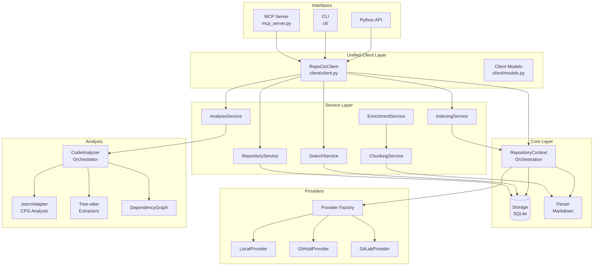
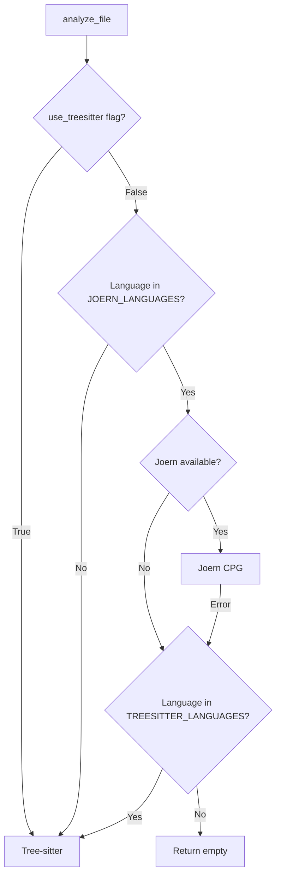
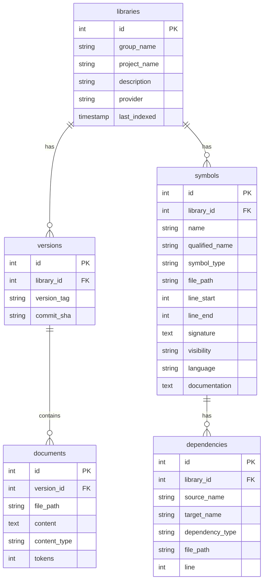

# repo-ctx Developer Guide

This guide covers architecture, internals, and development practices for contributors and developers extending repo-ctx.

---

## Table of Contents

1. [Architecture Overview](#architecture-overview)
2. [Project Structure](#project-structure)
3. [Core Components](#core-components)
4. [Unified Client](#unified-client)
5. [Service Layer](#service-layer)
6. [Code Analysis System](#code-analysis-system)
7. [Content Processing](#content-processing)
8. [Provider Abstraction](#provider-abstraction)
9. [Database Schema](#database-schema)
10. [Development Setup](#development-setup)
11. [Testing](#testing)
12. [Adding Features](#adding-features)

---

## Architecture Overview

repo-ctx uses a layered architecture with a unified client for all interfaces:



### Stakeholder View

| Stakeholder | Primary Entry Point | Documentation |
|-------------|---------------------|---------------|
| LLM/AI Users | MCP Server | [USER_GUIDE.md](user_guide.md) |
| CLI Users | CLI Commands | [USER_GUIDE.md](user_guide.md) |
| Library Developers | `RepoCtxClient` | [API Reference](library/api-reference.md) |
| Contributors | This guide | [ADRs](architecture/) |

### Data Flow

**Indexing:**
```
Client → IndexingService → Provider → Parser → Storage
```

**Search:**
```
Client → SearchService → Storage → FuzzyMatch → Results
```

**Analysis:**
```
Client → AnalysisService → CodeAnalyzer → Joern/Tree-sitter → Symbols
```

**Content Processing:**
```
Content → ChunkingService → Chunks → EnrichmentService → EnrichedContent
```

---

## Project Structure

```
repo_ctx/
├── core.py              # Legacy API: RepositoryContext
├── config.py            # Configuration management
├── storage.py           # SQLite persistence (aiosqlite)
├── mcp_server.py        # MCP protocol implementation
├── mcp_tools_ctx.py     # MCP ctx-* tools
├── parser.py            # Markdown processing
├── models.py            # Dataclasses: Library, Document
│
├── client/              # Unified client (NEW)
│   ├── __init__.py      # Package exports
│   ├── client.py        # RepoCtxClient - main interface
│   └── models.py        # Client data models
│
├── services/            # Service layer (NEW)
│   ├── __init__.py      # Factory functions
│   ├── base.py          # BaseService, ServiceContext
│   ├── repository.py    # RepositoryService
│   ├── indexing.py      # IndexingService
│   ├── search.py        # SearchService
│   ├── analysis.py      # AnalysisService
│   ├── chunking.py      # ChunkingService (content splitting)
│   ├── enrichment.py    # EnrichmentService (LLM metadata)
│   ├── embedding.py     # EmbeddingService (optional)
│   ├── llm.py           # LLMService (optional)
│   ├── combined_search.py  # CombinedSearchService
│   └── progress.py      # Progress tracking
│
├── providers/           # Git provider abstraction
│   ├── base.py          # Abstract GitProvider interface
│   ├── factory.py       # Provider factory
│   ├── local.py         # Local filesystem provider
│   ├── github.py        # GitHub API provider
│   └── gitlab.py        # GitLab API provider
│
├── analysis/            # Code analysis
│   ├── __init__.py      # Exports: CodeAnalyzer, DependencyGraph
│   ├── code_analyzer.py # Main analyzer
│   ├── models.py        # Symbol, SymbolType
│   ├── file_enhancer.py # LLM file documentation (parallel, retry)
│   ├── codebase_summarizer.py  # Business/technical summaries
│   ├── prompts.py       # LLM prompt templates
│   ├── architecture.py  # Architecture analysis
│   ├── architecture_rules.py  # Rule checking
│   ├── structural_metrics.py  # XS score
│   ├── python_extractor.py
│   ├── javascript_extractor.py
│   ├── java_extractor.py
│   ├── kotlin_extractor.py
│   ├── smalltalk_extractor.py
│   ├── dependency_graph.py
│   └── interactive_graph.py  # vis.js HTML graph generator
│
├── joern/               # Joern CPG integration
│   ├── adapter.py       # JoernAdapter
│   ├── models.py        # CPG models
│   └── queries.py       # CPGQL helpers
│
├── cli/                 # CLI implementation
│   ├── __init__.py      # CLI entry point
│   ├── context.py       # CLIContext (wraps RepoCtxClient)
│   ├── flat_commands.py # Flat command handlers
│   ├── target.py        # Target detection
│   └── interactive.py   # Interactive mode
│
└── mcp/                 # MCP server components
    ├── __init__.py
    └── server_context.py  # MCPServerContext (wraps RepoCtxClient)
```

---

## Core Components

### Configuration (`config.py`)

Unified configuration with priority-based loading:

```python
config = Config.load()      # Auto-discovery
config = Config.from_env()  # Environment variables
config = Config.from_yaml("config.yaml")
```

**Priority:** CLI args > Environment > Config file > Defaults

### Storage (`storage.py`)

Async SQLite operations via aiosqlite:

```python
class Storage:
    async def init()
    async def save_library(library: Library)
    async def save_document(document: Document)
    async def search_libraries(query: str, limit: int)
    async def get_documentation(library_id: str, version: str)
```

---

## Unified Client

The `RepoCtxClient` provides a single interface for all repo-ctx operations, used by CLI, MCP, and library consumers.

### Design Principles

1. **Dual-mode**: Supports direct (service layer) and HTTP (REST API) modes
2. **Async-first**: All operations are async
3. **Context manager**: Proper resource lifecycle
4. **Type-safe**: Typed models with dict conversion

### Client Architecture

```python
class RepoCtxClient:
    """Unified client for repo-ctx operations."""

    def __init__(
        self,
        config: Config = None,
        api_url: str = None,      # HTTP mode
        api_key: str = None,
        mode: ClientMode = None,  # DIRECT or HTTP
    ):
        # Auto-detect mode based on api_url
        self.mode = mode or (ClientMode.HTTP if api_url else ClientMode.DIRECT)

    async def connect(self) -> None:
        """Initialize client and establish connections."""

    async def close(self) -> None:
        """Clean up resources."""

    # Library operations
    async def list_libraries(self, provider: str = None) -> list[Library]
    async def get_library(self, library_id: str) -> Library | None
    async def search_libraries(self, query: str, fuzzy: bool = True) -> list[SearchResult]

    # Indexing operations
    async def index_repository(self, repository: str, provider: str = None) -> IndexResult
    async def index_group(self, group: str, provider: str = None) -> list[IndexResult]

    # Documentation operations
    async def get_documentation(self, library_id: str, **kwargs) -> dict

    # Analysis operations
    async def analyze_code(self, code: str, file_path: str) -> AnalysisResult
```

### Context Adapters

CLI and MCP use context adapters that wrap `RepoCtxClient`:

```python
# CLI Context (cli/context.py)
class CLIContext:
    def __init__(self, config: Config):
        self._client = RepoCtxClient(config=config)

    async def init(self):
        await self._client.connect()

# MCP Server Context (mcp/server_context.py)
class MCPServerContext:
    def __init__(self, config: Config):
        self._client = RepoCtxClient(config=config)

    @property
    def legacy(self):
        return self._client._legacy_context
```

---

## Service Layer

The service layer provides business logic between interfaces and storage.

### ServiceContext

Dependency injection container for services:

```python
from repo_ctx.services import create_service_context, ServiceContext

context = create_service_context(config)
# context.content_storage - SQLite storage
# context.vector_storage - Qdrant (optional)
# context.graph_storage - Neo4j (optional)
```

### Available Services

| Service | Factory Function | Purpose |
|---------|------------------|---------|
| `RepositoryService` | `create_repository_service()` | Repository management |
| `IndexingService` | `create_indexing_service()` | Repository indexing |
| `SearchService` | `create_search_service()` | Search operations |
| `AnalysisService` | `create_analysis_service()` | Code analysis |
| `ChunkingService` | `create_chunking_service()` | Content chunking |
| `EnrichmentService` | `create_enrichment_service()` | LLM metadata |
| `EmbeddingService` | `create_embedding_service()` | Vector embeddings |
| `LLMService` | `create_llm_service()` | LLM operations |

### Creating Services

```python
from repo_ctx.services import (
    create_service_context,
    create_repository_service,
    create_analysis_service,
    create_chunking_service,
)

context = create_service_context()
repo_service = create_repository_service(context)
analysis_service = create_analysis_service(context)
chunking_service = create_chunking_service(default_strategy="semantic")
```

---

## Code Analysis System

### Backend Selection



### CodeAnalyzer

```python
class CodeAnalyzer:
    JOERN_LANGUAGES = {
        ".c", ".cpp", ".go", ".php", ".rb", ".swift", ".cs",
        ".py", ".js", ".ts", ".java", ".kt"
    }

    TREESITTER_LANGUAGES = {
        ".py", ".js", ".ts", ".java", ".kt", ".st"
    }

    def analyze_file(code: str, file_path: str) -> tuple[list[Symbol], list[str]]
    def analyze_files(files: dict[str, str]) -> dict[str, list[Symbol]]
```

### Architecture Analysis

```python
from repo_ctx.analysis import (
    ArchitectureAnalyzer,
    StructuralMetrics,
)

# DSM, cycles, layers
analyzer = ArchitectureAnalyzer()
dsm = analyzer.compute_dsm(symbols, dependencies)
cycles = analyzer.detect_cycles(symbols, dependencies)
layers = analyzer.detect_layers(symbols, dependencies)

# XS metrics
metrics = StructuralMetrics()
score = metrics.compute_xs_score(symbols, dependencies)
```

---

## Content Processing

### ChunkingService

Split content optimally for LLM processing:

```python
from repo_ctx.services import ChunkingService, Chunk, ChunkType

chunking = ChunkingService(default_strategy="semantic")

# Semantic chunking (respects code boundaries)
chunks = chunking.chunk(code, "service.py", strategy="semantic")

# Token-aware chunking
chunks = chunking.chunk_for_embedding(content, "doc.md", max_tokens=500)

# LLM context chunking
chunks = chunking.chunk_for_context(content, "doc.md", max_tokens=2000)
```

**Strategies:**

| Strategy | Class | Best For |
|----------|-------|----------|
| `semantic` | `SemanticChunking` | Code files |
| `markdown` | `MarkdownChunking` | Documentation |
| `token_based` | `TokenBasedChunking` | Any text |
| `fixed_size` | `FixedSizeChunking` | Raw text |

### EnrichmentService

Add LLM-powered metadata (with heuristic fallbacks):

```python
from repo_ctx.services import EnrichmentService, create_llm_service

# With LLM
llm = create_llm_service(context, model="gpt-5-mini")
enrichment = EnrichmentService(context, llm_service=llm)

# Without LLM (uses heuristics)
enrichment = EnrichmentService(context, use_llm=False)

# Enrich code
metadata = await enrichment.enrich_code(code, "python", "service.py")
# metadata.summary, metadata.tags, metadata.quality_score

# Enrich symbols
enriched = await enrichment.enrich_symbol(name, qualified_name, "class", code)
# enriched.summary, enriched.tags, enriched.related_concepts

# Enrich documents
enriched = await enrichment.enrich_document(content, "doc.md", "markdown")
# enriched.summary, enriched.tags, enriched.chunks
```

### FileEnhancer

Enhances symbol documentation using LLM with full source code context:

```python
from repo_ctx.analysis.file_enhancer import FileEnhancer

enhancer = FileEnhancer(
    llm_service=llm,
    source_root=Path("./src"),
)

# Enhance a single file
result = await enhancer.enhance_file(
    file_path="mymodule/service.py",
    symbols=[{"name": "MyClass", "type": "class"}],
    language="python",
)
# result = {"file": ..., "documentation": ..., "symbols": [...]}

# Enhance multiple files in parallel (recommended)
results = await enhancer.enhance_files_parallel(
    files_data=[...],
    max_concurrency=5,  # Control parallel LLM requests
    progress_callback=lambda f, i, n: print(f"Processing {f} ({i}/{n})"),
)
```

**Configuration Constants:**

| Constant | Default | Description |
|----------|---------|-------------|
| `MAX_CODE_CHARS` | 12000 | Max source code chars per prompt (~3000 tokens) |
| `MAX_RETRIES` | 3 | Retry attempts for empty LLM responses |
| `RETRY_DELAY` | 1.0 | Seconds between retry attempts |

### CodebaseSummarizer

Generates consolidated codebase summaries from symbol documentation:

```python
from repo_ctx.analysis.codebase_summarizer import CodebaseSummarizer

summarizer = CodebaseSummarizer(llm_service=llm)

# Generate business summary (default)
summary = await summarizer.generate_summary(
    repo_ctx_path=Path(".repo-ctx"),
    project_name="MyProject",
    summary_type="business",  # or "technical"
)

# Generate and save to file
output_path = await summarizer.generate_and_save(
    repo_ctx_path=Path(".repo-ctx"),
    project_name="MyProject",
    output_filename="CODEBASE_SUMMARY.md",
)
```

**Summary Types:**

| Type | Description |
|------|-------------|
| `business` | Non-technical summary for stakeholders (executive summary, capabilities, value) |
| `technical` | Architecture overview, core modules, design patterns, technical debt |

**Configuration Constants:**

| Constant | Default | Description |
|----------|---------|-------------|
| `MAX_CONTEXT_CHARS` | 100000 | Max chars for LLM context (~25000 tokens) |
| `MAX_README_CHARS` | 8000 | Max README chars to include (~2000 tokens) |
| `MAX_RETRIES` | 3 | Retry attempts for empty LLM responses |
| `RETRY_DELAY` | 1.0 | Seconds between retry attempts |

### InteractiveGraphGenerator

Generates interactive HTML dependency graphs using vis.js:

```python
from repo_ctx.analysis.interactive_graph import InteractiveGraphGenerator
from pathlib import Path

generator = InteractiveGraphGenerator()

# Generate from nodes and edges
html_path = generator.generate(
    nodes=[
        {"id": "main.py", "type": "file"},
        {"id": "utils.py", "type": "file"},
    ],
    edges=[
        ("main.py", "utils.py", "import"),
    ],
    output_path=Path(".repo-ctx/architecture/dependencies.html"),
    title="My Project Dependencies",
    cycles=[["main.py", "utils.py"]],  # Optional: highlight cycle nodes
    layers=[{"level": 0, "nodes": ["main.py"]}],  # Optional: layer info
)

# Generate from architecture data dict (from DumpService)
html_path = generator.generate_from_arch_data(
    arch_data={
        "nodes": ["main.py", "utils.py"],
        "edges": [("main.py", "utils.py", "import")],
        "cycles": {"cycles": []},
        "layers": {"layers": []},
    },
    output_path=Path("dependencies.html"),
    title="Architecture Overview",
)
```

**Features:**

| Feature | Description |
|---------|-------------|
| Search | Find nodes by name |
| Filter | Show all, high-connectivity, or cycle nodes |
| Layout | Force-directed or hierarchical layouts |
| Node info | Click nodes to see connections |
| Color coding | Nodes colored by type (file, class, package, cycle) |
| Sidebar | Statistics, legend, and selected node details |

**Usage in DumpService:**

The interactive graph is automatically generated during `dump` with MEDIUM or FULL level:
- Output: `.repo-ctx/architecture/dependencies.html`
- Linked from `ARCHITECTURE_SUMMARY.md`

---

## Provider Abstraction

### GitProvider Interface

```python
class GitProvider(ABC):
    @abstractmethod
    async def get_project(path: str) -> Project

    @abstractmethod
    async def get_file_tree(project, ref: str) -> list[str]

    @abstractmethod
    async def read_file(project, path: str, ref: str) -> str

    @abstractmethod
    async def get_branches(project) -> list[str]

    @abstractmethod
    async def get_tags(project) -> list[str]
```

### Adding a New Provider

1. Create `providers/newprovider.py` implementing `GitProvider`
2. Register in `providers/factory.py`
3. Add config support in `config.py`
4. Write tests in `tests/test_providers_newprovider.py`

---

## Database Schema



---

## Development Setup

### Prerequisites

- Python 3.10+
- uv (recommended) or pip
- Git

### Installation

```bash
git clone https://github.com/anthropics/repo-ctx.git
cd repo-ctx

# Install with development dependencies
uv pip install -e ".[dev]"

# Or using pip
pip install -e ".[dev]"
```

### Optional: Joern

```bash
# Requires Java 19+
curl -L "https://github.com/joernio/joern/releases/latest/download/joern-install.sh" | bash
export PATH="$HOME/bin/joern:$PATH"
joern --version
```

---

## Testing

### Running Tests

```bash
# All tests
pytest tests/ -v

# With coverage
pytest tests/ -v --cov=repo_ctx

# Specific categories
pytest tests/test_client.py -v           # Unified client
pytest tests/test_chunking.py -v         # Chunking service
pytest tests/test_enrichment.py -v       # Enrichment service
pytest tests/test_mcp_server_context.py  # MCP context
pytest tests/test_analysis_*.py -v       # Analysis tests
pytest tests/test_providers_*.py -v      # Provider tests
```

### Test Coverage Requirements

- Overall: >80%
- New features: >90%
- Critical paths: 100%

### Mocking Strategy

- **Git APIs:** Mock python-gitlab, PyGithub responses
- **File System:** Use `tmp_path` fixture
- **Database:** Use `:memory:` SQLite
- **External Services:** Mock HTTP responses

---

## Adding Features

### New Service

1. Create `services/new_service.py`:

```python
from repo_ctx.services.base import BaseService, ServiceContext

class NewService(BaseService):
    def __init__(self, context: ServiceContext, **kwargs):
        super().__init__(context)
        # Initialize

    async def operation(self, param: str) -> Result:
        # Implementation
        pass
```

2. Add factory in `services/__init__.py`:

```python
def create_new_service(context: ServiceContext, **kwargs) -> NewService:
    return NewService(context, **kwargs)
```

3. Export in `__all__`
4. Write tests in `tests/test_new_service.py`

### New MCP Tool

1. Add tool schema in `mcp_tools_ctx.py` or `mcp_server.py`
2. Implement handler
3. Add tests

### New CLI Command

1. Add command in `cli/flat_commands.py`
2. Write tests

### New Language Extractor

1. Create `analysis/language_extractor.py`
2. Register in `analysis/code_analyzer.py`
3. Add tree-sitter dependency
4. Write tests

---

## Key Classes Reference

| Class | Module | Purpose |
|-------|--------|---------|
| `RepoCtxClient` | `client/client.py` | Unified client interface |
| `CLIContext` | `cli/context.py` | CLI context wrapper |
| `MCPServerContext` | `mcp/server_context.py` | MCP context wrapper |
| `ServiceContext` | `services/base.py` | Service dependency injection |
| `ChunkingService` | `services/chunking.py` | Content chunking |
| `EnrichmentService` | `services/enrichment.py` | LLM metadata |
| `FileEnhancer` | `analysis/file_enhancer.py` | LLM file documentation with parallel processing |
| `CodebaseSummarizer` | `analysis/codebase_summarizer.py` | Business/technical codebase summaries |
| `InteractiveGraphGenerator` | `analysis/interactive_graph.py` | vis.js interactive HTML graph |
| `CodeAnalyzer` | `analysis/code_analyzer.py` | Code analysis |
| `ArchitectureAnalyzer` | `analysis/architecture.py` | Architecture analysis |
| `GitProvider` | `providers/base.py` | Provider interface |

---

## Further Reading

- [User Guide](user_guide.md) - Usage and examples
- [API Reference](library/api-reference.md) - Python library API
- [Architecture Analysis Guide](architecture_analysis_guide.md) - DSM, cycles, metrics
- [MCP Tools Reference](mcp_tools_reference.md) - MCP tool documentation
- [Architecture Decisions](architecture/) - ADRs
