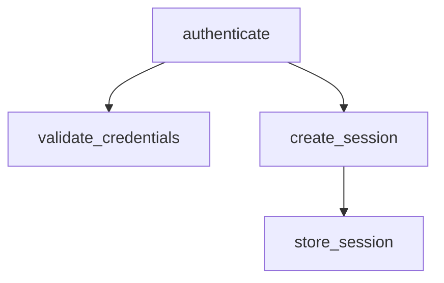

# Requirements Analysis: Semantic Code Analysis & Dependency Mapping

**Feature ID:** REQ-001
**Priority:** HIGH
**Status:** Planning
**Created:** 2025-11-26
**Owner:** Core Team

---

## Executive Summary

Build a comprehensive code analysis engine that extracts semantic information from source code across multiple programming languages. This system will enable AI agents to understand code architecture, dependencies, call graphs, and relationships without executing code.

**Key Value Propositions:**
- **For AI Agents:** Architectural understanding enables better code generation, refactoring, and debugging
- **For Developers:** Visual dependency maps, call graphs, and impact analysis
- **For Documentation:** Automatic API discovery and reference generation

**Core Technologies:**
- **Tree-sitter** for multi-language parsing
- **SQLite** for indexing and querying
- **MCP Protocol** for agent integration
- **Graph algorithms** for dependency analysis

---

## 1. Goals & Objectives

### Primary Goals

1. **Extract Code Structure**
   - Parse source files to extract functions, classes, methods, variables
   - Build abstract syntax trees (AST) for semantic analysis
   - Support 15+ programming languages including legacy languages

2. **Map Dependencies**
   - Track import/export relationships
   - Build function call graphs
   - Identify module dependencies
   - Detect circular dependencies

3. **Enable Agent Queries**
   - "What functions does module X export?"
   - "Where is function Y called?"
   - "What are the dependencies of component Z?"
   - "Show me the call graph for this feature"

4. **Provide Visual Insights**
   - Generate dependency diagrams (Mermaid, DOT)
   - Module relationship graphs
   - Call flow visualizations
   - Impact analysis ("what breaks if I change X?")

### Non-Goals (Out of Scope)

- ❌ Runtime behavior analysis (profiling, tracing)
- ❌ Code execution or interpretation
- ❌ Security vulnerability scanning (separate feature)
- ❌ Code formatting or linting
- ❌ Real-time IDE integration (focus on batch analysis)

---

## 2. Functional Requirements

### FR-1: Multi-Language Code Parsing

**Priority:** CRITICAL
**Description:** Parse source code files in multiple languages to extract semantic information.

**Supported Languages (Phase 1 - Modern):**
- ✅ **JavaScript** (.js, .mjs, .cjs)
- ✅ **TypeScript** (.ts, .tsx)
- ✅ **Python** (.py)
- ✅ **Go** (.go)
- ✅ **Rust** (.rs)
- ✅ **Java** (.java)
- ✅ **C#** (.cs)
- ✅ **Ruby** (.rb)
- ✅ **PHP** (.php)
- ✅ **C/C++** (.c, .cpp, .h, .hpp)

**Supported Languages (Phase 2 - Legacy & Additional):**
- ✅ **COBOL** (.cob, .cbl) - Enterprise legacy systems
- ✅ **Fortran** (.f, .f90, .f95) - Scientific computing
- ✅ **Perl** (.pl, .pm) - System administration
- ✅ **Bash/Shell** (.sh, .bash) - DevOps scripts
- ✅ **Lua** (.lua) - Embedded scripting
- ✅ **Scala** (.scala) - JVM ecosystem
- ✅ **Kotlin** (.kt) - Modern JVM
- ✅ **Swift** (.swift) - iOS/macOS development
- ✅ **Objective-C** (.m, .h) - Legacy iOS
- ✅ **Haskell** (.hs) - Functional programming

**Total:** 20 languages covering modern, legacy, and specialized domains

**Acceptance Criteria:**
- Successfully parse >95% of valid source files
- Extract basic structure: functions, classes, imports
- Handle syntax errors gracefully (partial parsing)
- Performance: <100ms per file for files <10KB

---

### FR-2: Symbol Extraction

**Priority:** CRITICAL
**Description:** Extract all code symbols with their metadata.

**Symbol Types:**
1. **Functions/Methods**
   - Name, parameters, return type
   - Visibility (public/private/protected)
   - Location (file, line number)
   - Documentation/docstrings
   - Decorators/annotations

2. **Classes/Interfaces**
   - Name, inheritance hierarchy
   - Member functions and properties
   - Generic/template parameters
   - Visibility modifiers

3. **Variables/Constants**
   - Name, type, scope
   - Global vs. local
   - Initialization values (if simple)

4. **Modules/Packages**
   - Module name and path
   - Exported symbols
   - Import relationships

5. **Type Definitions**
   - Type aliases
   - Enums
   - Structs (Go, Rust, C)
   - Interfaces (TypeScript, Go)

**Storage Format (SQLite Schema):**
```sql
CREATE TABLE symbols (
    id INTEGER PRIMARY KEY,
    repository_id INTEGER,
    version_id INTEGER,
    file_path TEXT NOT NULL,
    symbol_type TEXT NOT NULL, -- function, class, variable, etc.
    name TEXT NOT NULL,
    qualified_name TEXT, -- full.module.path.name
    line_start INTEGER,
    line_end INTEGER,
    signature TEXT, -- function signature
    visibility TEXT, -- public, private, protected
    language TEXT NOT NULL,
    documentation TEXT,
    metadata JSON, -- language-specific data
    FOREIGN KEY (repository_id) REFERENCES libraries(id)
);

CREATE INDEX idx_symbols_name ON symbols(name);
CREATE INDEX idx_symbols_type ON symbols(symbol_type);
CREATE INDEX idx_symbols_file ON symbols(file_path);
```

**Acceptance Criteria:**
- Extract 100% of top-level symbols
- Capture nested symbols (methods inside classes)
- Store accurate line numbers for navigation
- Extract docstrings where available

---

### FR-3: Dependency Graph Construction

**Priority:** CRITICAL
**Description:** Build a complete dependency graph showing relationships between code elements.

**Relationship Types:**
1. **Imports**
   - Module A imports Module B
   - Specific symbols imported (functions, classes)
   - Relative vs. absolute imports

2. **Function Calls**
   - Function A calls Function B
   - Call location (file, line)
   - Call context (within which function)

3. **Inheritance**
   - Class A extends/inherits Class B
   - Interface implementations

4. **Composition**
   - Class A has member of type Class B
   - Module A uses Module B

5. **Type Dependencies**
   - Function A returns type from Module B
   - Parameter types from other modules

**Storage Format:**
```sql
CREATE TABLE dependencies (
    id INTEGER PRIMARY KEY,
    source_symbol_id INTEGER NOT NULL,
    target_symbol_id INTEGER NOT NULL,
    dependency_type TEXT NOT NULL, -- import, call, inherit, compose
    location_file TEXT,
    location_line INTEGER,
    metadata JSON,
    FOREIGN KEY (source_symbol_id) REFERENCES symbols(id),
    FOREIGN KEY (target_symbol_id) REFERENCES symbols(id)
);

CREATE INDEX idx_deps_source ON dependencies(source_symbol_id);
CREATE INDEX idx_deps_target ON dependencies(target_symbol_id);
CREATE INDEX idx_deps_type ON dependencies(dependency_type);
```

**Acceptance Criteria:**
- Capture all import relationships
- Identify function calls with >90% accuracy
- Build complete inheritance trees
- Detect circular dependencies

---

### FR-4: Call Graph Generation

**Priority:** HIGH
**Description:** Generate call graphs showing function invocation chains.

**Features:**
- Forward call graph: "What does function X call?"
- Reverse call graph: "What calls function X?"
- Call chains: "Path from A to Z"
- Call depth analysis
- Unused function detection

**Example Query Results:**
```json
{
  "function": "authenticate",
  "file": "src/auth.py",
  "line": 45,
  "calls": [
    {"function": "validate_credentials", "file": "src/auth.py", "line": 50},
    {"function": "create_session", "file": "src/session.py", "line": 12},
    {"function": "log_event", "file": "src/logger.py", "line": 89}
  ],
  "called_by": [
    {"function": "login", "file": "src/api.py", "line": 120},
    {"function": "oauth_callback", "file": "src/oauth.py", "line": 67}
  ],
  "depth": 3,
  "total_downstream_calls": 15
}
```

**Acceptance Criteria:**
- Generate call graphs in <1s for codebases <100k LOC
- Support filtering by depth
- Export as JSON, Mermaid, DOT formats

---

### FR-5: Module Dependency Analysis

**Priority:** HIGH
**Description:** Analyze module-level dependencies and architectural patterns.

**Capabilities:**
1. **Dependency Matrix**
   - Which modules depend on which
   - Strength of coupling (# of dependencies)
   - Bidirectional dependencies

2. **Circular Dependency Detection**
   - Identify cycles in dependency graph
   - Suggest breaking points
   - Severity scoring

3. **Architectural Layers**
   - Auto-detect layered architecture
   - Identify layer violations
   - Suggest refactoring

4. **Dependency Metrics**
   - Fan-in: How many modules depend on X
   - Fan-out: How many modules X depends on
   - Instability: Fan-out / (Fan-in + Fan-out)

**Acceptance Criteria:**
- Detect all circular dependencies
- Generate dependency matrix for 100+ module codebases
- Calculate metrics with <5% error margin

---

### FR-6: Impact Analysis

**Priority:** MEDIUM
**Description:** Determine what code is affected by changes to a symbol.

**Query:** "If I change function X, what breaks?"

**Analysis:**
- Direct dependents (functions that call X)
- Transitive dependents (call chain impact)
- Test coverage (which tests exercise X)
- Documentation references

**Example Output:**
```
Impact Analysis: function authenticate()

Direct Impact (3 files):
- src/api.py:120 - login() calls authenticate()
- src/oauth.py:67 - oauth_callback() calls authenticate()
- src/admin.py:45 - sudo_login() calls authenticate()

Transitive Impact (8 files):
- src/routes.py:30 → login() → authenticate()
- src/middleware.py:15 → verify_session() → login() → authenticate()
[... chain continues ...]

Estimated Blast Radius: 11 files, 23 functions
Risk Level: MEDIUM
```

**Acceptance Criteria:**
- Compute impact in <2s
- Include up to 5 levels deep
- Provide confidence scores

---

## 3. MCP Tool Integration

### MCP Tools to Implement

#### Tool 1: `repo-ctx-analyze-code`

**Description:** Analyze a repository's code structure and build dependency graph.

**Parameters:**
```json
{
  "repository": "string (required)",
  "languages": ["string (optional)"],
  "includeTests": "boolean (default: false)",
  "maxDepth": "integer (default: 10)"
}
```

**Response:**
```json
{
  "summary": {
    "total_files": 245,
    "total_symbols": 1893,
    "languages": ["python", "javascript"],
    "analysis_time_ms": 3421
  },
  "top_modules": [
    {"name": "src/core", "symbols": 234, "dependencies": 15},
    {"name": "src/api", "symbols": 189, "dependencies": 12}
  ]
}
```

---

#### Tool 2: `repo-ctx-get-symbol`

**Description:** Get detailed information about a specific symbol (function, class, etc.).

**Parameters:**
```json
{
  "repository": "string (required)",
  "symbolName": "string (required)",
  "symbolType": "string (optional)" // function, class, variable
}
```

**Response:**
```json
{
  "symbol": {
    "name": "authenticate",
    "type": "function",
    "file": "src/auth.py",
    "line": 45,
    "signature": "authenticate(username: str, password: str) -> User",
    "visibility": "public",
    "documentation": "Authenticate user with credentials...",
    "calls": ["validate_credentials", "create_session"],
    "called_by": ["login", "oauth_callback"],
    "dependencies": ["hashlib", "secrets"]
  }
}
```

---

#### Tool 3: `repo-ctx-get-dependencies`

**Description:** Get dependency information for a module or file.

**Parameters:**
```json
{
  "repository": "string (required)",
  "path": "string (required)", // module or file path
  "direction": "string (optional)" // "incoming", "outgoing", "both" (default)
}
```

**Response:**
```json
{
  "path": "src/auth.py",
  "outgoing": [
    {"module": "src/session.py", "symbols": ["create_session", "destroy_session"]},
    {"module": "src/logger.py", "symbols": ["log_event"]},
    {"module": "hashlib", "symbols": ["sha256"], "external": true}
  ],
  "incoming": [
    {"module": "src/api.py", "symbols": ["login", "logout"]},
    {"module": "src/oauth.py", "symbols": ["oauth_callback"]}
  ],
  "circular_dependencies": []
}
```

---

#### Tool 4: `repo-ctx-call-graph`

**Description:** Generate a call graph for a function or module.

**Parameters:**
```json
{
  "repository": "string (required)",
  "symbol": "string (required)",
  "direction": "string (optional)", // "forward", "backward", "both"
  "maxDepth": "integer (default: 5)",
  "format": "string (optional)" // "json", "mermaid", "dot"
}
```

**Response (JSON):**
```json
{
  "root": "authenticate",
  "direction": "forward",
  "graph": {
    "nodes": [
      {"id": "authenticate", "file": "src/auth.py", "line": 45},
      {"id": "validate_credentials", "file": "src/auth.py", "line": 67},
      {"id": "create_session", "file": "src/session.py", "line": 12}
    ],
    "edges": [
      {"from": "authenticate", "to": "validate_credentials"},
      {"from": "authenticate", "to": "create_session"}
    ]
  }
}
```

**Response (Mermaid):**


---

#### Tool 5: `repo-ctx-find-symbol`

**Description:** Search for symbols by name, type, or pattern.

**Parameters:**
```json
{
  "repository": "string (required)",
  "query": "string (required)",
  "symbolType": "string (optional)",
  "language": "string (optional)",
  "limit": "integer (default: 20)"
}
```

**Response:**
```json
{
  "results": [
    {
      "name": "authenticate",
      "type": "function",
      "file": "src/auth.py",
      "line": 45,
      "signature": "authenticate(username: str, password: str) -> User"
    },
    {
      "name": "authenticate_api_key",
      "type": "function",
      "file": "src/api_auth.py",
      "line": 23,
      "signature": "authenticate_api_key(key: str) -> bool"
    }
  ],
  "total": 2
}
```

---

#### Tool 6: `repo-ctx-impact-analysis`

**Description:** Analyze the impact of changing a symbol.

**Parameters:**
```json
{
  "repository": "string (required)",
  "symbol": "string (required)",
  "maxDepth": "integer (default: 5)"
}
```

**Response:**
```json
{
  "symbol": "authenticate",
  "direct_dependents": 3,
  "transitive_dependents": 11,
  "affected_files": ["src/api.py", "src/oauth.py", "src/admin.py"],
  "blast_radius": {
    "files": 11,
    "functions": 23,
    "lines_of_code": 456
  },
  "risk_level": "MEDIUM",
  "suggestions": [
    "Add deprecation warning before removing",
    "Consider backward compatibility wrapper"
  ]
}
```

---

#### Tool 7: `repo-ctx-circular-deps`

**Description:** Find circular dependencies in a repository.

**Parameters:**
```json
{
  "repository": "string (required)",
  "minCycleLength": "integer (default: 2)"
}
```

**Response:**
```json
{
  "cycles": [
    {
      "cycle": ["src/auth.py", "src/session.py", "src/auth.py"],
      "length": 2,
      "severity": "HIGH",
      "suggestion": "Consider moving create_session to separate module"
    },
    {
      "cycle": ["src/api.py", "src/models.py", "src/validators.py", "src/api.py"],
      "length": 3,
      "severity": "MEDIUM",
      "suggestion": "Extract validation logic to standalone module"
    }
  ],
  "total_cycles": 2
}
```

---

## 4. Technical Architecture

### 4.1 Component Design

```
┌─────────────────────────────────────────────────────────────┐
│                     MCP Server Layer                         │
│  (repo-ctx-analyze-code, repo-ctx-get-symbol, etc.)        │
└────────────────────┬────────────────────────────────────────┘
                     │
┌────────────────────▼────────────────────────────────────────┐
│              Code Analysis Engine (Core)                     │
│  - Language detection                                        │
│  - Parser orchestration                                      │
│  - Symbol extraction                                         │
│  - Dependency resolution                                     │
└────────────────────┬────────────────────────────────────────┘
                     │
┌────────────────────▼────────────────────────────────────────┐
│           Tree-sitter Parser Layer                          │
│  ┌──────────┬──────────┬──────────┬──────────┐            │
│  │ Python   │   JS/TS  │   Go     │  Rust    │ ...        │
│  │ Parser   │  Parser  │  Parser  │  Parser  │            │
│  └──────────┴──────────┴──────────┴──────────┘            │
└────────────────────┬────────────────────────────────────────┘
                     │
┌────────────────────▼────────────────────────────────────────┐
│              Storage Layer (SQLite)                          │
│  - symbols table                                             │
│  - dependencies table                                        │
│  - call_graph table                                          │
│  - analysis_cache table                                      │
└─────────────────────────────────────────────────────────────┘
```

### 4.2 Technology Stack

**Core:**
- **Language:** Python 3.11+ (async support)
- **Parser:** Tree-sitter with language bindings
- **Database:** SQLite with FTS5 for symbol search
- **Graph Processing:** NetworkX for dependency analysis

**Tree-sitter Language Bindings:**
```python
tree-sitter==0.21.0
tree-sitter-python==0.21.0
tree-sitter-javascript==0.21.0
tree-sitter-typescript==0.21.0
tree-sitter-go==0.21.0
tree-sitter-rust==0.21.0
tree-sitter-java==0.21.0
tree-sitter-c==0.21.0
tree-sitter-cpp==0.21.0
tree-sitter-c-sharp==0.21.0
tree-sitter-ruby==0.21.0
tree-sitter-php==0.21.0
# Legacy languages:
tree-sitter-bash==0.21.0
tree-sitter-lua==0.21.0
```

**Visualization:**
- **Mermaid** (text-based diagrams)
- **Graphviz DOT** (advanced layouts)

---

### 4.3 Database Schema

```sql
-- Symbols (functions, classes, variables)
CREATE TABLE symbols (
    id INTEGER PRIMARY KEY,
    repository_id INTEGER NOT NULL,
    version_id INTEGER,
    file_path TEXT NOT NULL,
    symbol_type TEXT NOT NULL, -- function, class, variable, module, interface
    name TEXT NOT NULL,
    qualified_name TEXT, -- full.module.path.name
    line_start INTEGER NOT NULL,
    line_end INTEGER,
    column_start INTEGER,
    signature TEXT, -- function(args) -> return
    visibility TEXT, -- public, private, protected, internal
    language TEXT NOT NULL,
    documentation TEXT,
    is_exported BOOLEAN DEFAULT 0,
    complexity INTEGER, -- cyclomatic complexity
    metadata JSON, -- language-specific fields
    created_at TIMESTAMP DEFAULT CURRENT_TIMESTAMP,
    FOREIGN KEY (repository_id) REFERENCES libraries(id)
);

CREATE INDEX idx_symbols_name ON symbols(name);
CREATE INDEX idx_symbols_qualified ON symbols(qualified_name);
CREATE INDEX idx_symbols_type ON symbols(symbol_type);
CREATE INDEX idx_symbols_file ON symbols(file_path);
CREATE INDEX idx_symbols_lang ON symbols(language);

-- Full-text search on symbol names and documentation
CREATE VIRTUAL TABLE symbols_fts USING fts5(
    name, qualified_name, documentation,
    content='symbols', content_rowid='id'
);

-- Dependencies between symbols
CREATE TABLE dependencies (
    id INTEGER PRIMARY KEY,
    source_symbol_id INTEGER NOT NULL,
    target_symbol_id INTEGER NOT NULL,
    dependency_type TEXT NOT NULL, -- import, call, inherit, compose, implement
    location_file TEXT,
    location_line INTEGER,
    is_external BOOLEAN DEFAULT 0, -- external library
    external_module TEXT, -- e.g., "numpy", "express"
    strength INTEGER DEFAULT 1, -- number of references
    metadata JSON,
    FOREIGN KEY (source_symbol_id) REFERENCES symbols(id) ON DELETE CASCADE,
    FOREIGN KEY (target_symbol_id) REFERENCES symbols(id) ON DELETE CASCADE
);

CREATE INDEX idx_deps_source ON dependencies(source_symbol_id);
CREATE INDEX idx_deps_target ON dependencies(target_symbol_id);
CREATE INDEX idx_deps_type ON dependencies(dependency_type);
CREATE UNIQUE INDEX idx_deps_unique ON dependencies(source_symbol_id, target_symbol_id, dependency_type);

-- Call graph edges (optimized for graph queries)
CREATE TABLE call_graph (
    id INTEGER PRIMARY KEY,
    caller_id INTEGER NOT NULL,
    callee_id INTEGER NOT NULL,
    call_count INTEGER DEFAULT 1,
    call_locations JSON, -- [{file, line}]
    FOREIGN KEY (caller_id) REFERENCES symbols(id) ON DELETE CASCADE,
    FOREIGN KEY (callee_id) REFERENCES symbols(id) ON DELETE CASCADE
);

CREATE INDEX idx_callgraph_caller ON call_graph(caller_id);
CREATE INDEX idx_callgraph_callee ON call_graph(callee_id);

-- Analysis cache (avoid re-parsing unchanged files)
CREATE TABLE analysis_cache (
    id INTEGER PRIMARY KEY,
    repository_id INTEGER NOT NULL,
    file_path TEXT NOT NULL,
    file_hash TEXT NOT NULL, -- SHA256 of file content
    last_analyzed TIMESTAMP DEFAULT CURRENT_TIMESTAMP,
    symbols_count INTEGER,
    dependencies_count INTEGER,
    UNIQUE(repository_id, file_path),
    FOREIGN KEY (repository_id) REFERENCES libraries(id)
);

-- Circular dependencies (pre-computed for performance)
CREATE TABLE circular_dependencies (
    id INTEGER PRIMARY KEY,
    repository_id INTEGER NOT NULL,
    cycle_hash TEXT NOT NULL, -- hash of sorted cycle
    cycle_path JSON NOT NULL, -- ["A", "B", "C", "A"]
    cycle_length INTEGER NOT NULL,
    severity TEXT, -- LOW, MEDIUM, HIGH
    detected_at TIMESTAMP DEFAULT CURRENT_TIMESTAMP,
    UNIQUE(repository_id, cycle_hash),
    FOREIGN KEY (repository_id) REFERENCES libraries(id)
);
```

---

## 5. Implementation Plan

### Phase 1: Foundation (Week 1-2)

**Goals:**
- Set up Tree-sitter infrastructure
- Implement basic parsing for 3 languages (Python, JavaScript, TypeScript)
- Build database schema
- Create symbol extraction

**Deliverables:**
- `CodeParser` class with Tree-sitter integration
- `SymbolExtractor` for Python, JS, TS
- Database migrations
- Basic CLI: `repo-ctx analyze <path>`

**Testing:**
- Unit tests for each language parser
- Integration test: analyze small repository
- Performance test: 100 files in <10s

---

### Phase 2: Dependency Analysis (Week 3-4)

**Goals:**
- Extract import relationships
- Build dependency graph
- Implement call graph generation
- Add 5 more languages (Go, Rust, Java, C#, Ruby)

**Deliverables:**
- `DependencyAnalyzer` class
- `CallGraphBuilder` class
- Support for 8 languages total
- CLI: `repo-ctx deps <path>`

**Testing:**
- Test import resolution for each language
- Verify call graph accuracy
- Cross-module dependency tests

---

### Phase 3: MCP Integration (Week 5)

**Goals:**
- Implement 7 MCP tools
- Test with AI agents (Claude, GPT-4)
- Performance optimization

**Deliverables:**
- 7 MCP tools fully functional
- MCP server integration tests
- Documentation for MCP usage

**Testing:**
- Test each MCP tool independently
- Integration tests with MCP clients
- Load testing with large codebases

---

### Phase 4: Additional Languages & Polish (Week 6-7)

**Goals:**
- Add remaining 12 languages (including legacy)
- Implement impact analysis
- Circular dependency detection
- Visualization exports (Mermaid, DOT)

**Deliverables:**
- Support for all 20 languages
- Impact analysis feature
- Circular dependency detector
- Export formats

**Testing:**
- Legacy language parsing tests (COBOL, Fortran)
- Impact analysis accuracy tests
- Visualization format validation

---

### Phase 5: Optimization & Documentation (Week 8)

**Goals:**
- Performance optimization (caching, indexing)
- Comprehensive documentation
- Example use cases
- Tutorial videos

**Deliverables:**
- Performance: <5s for 10K file repository
- Complete user documentation
- Agent integration examples
- Benchmark results

---

## 6. Success Criteria

### Functional Success

- ✅ Parse 20+ programming languages with >95% success rate
- ✅ Extract all public symbols (functions, classes) with 100% accuracy
- ✅ Build complete dependency graph with <5% missing edges
- ✅ Generate call graphs with <10% false positives
- ✅ Detect 100% of circular dependencies
- ✅ All 7 MCP tools working and tested

### Performance Success

- ✅ Analyze <10K LOC repository in <5 seconds
- ✅ Analyze 100K LOC repository in <60 seconds
- ✅ Call graph query response in <1 second
- ✅ Symbol search in <100ms
- ✅ Incremental re-analysis: only changed files

### Quality Success

- ✅ Test coverage >85%
- ✅ No critical bugs in production
- ✅ Documentation completeness >90%
- ✅ AI agent integration examples for 3+ agents

---

## 7. Risks & Mitigations

| Risk | Impact | Probability | Mitigation |
|------|--------|-------------|------------|
| Tree-sitter parsing failures for complex code | HIGH | MEDIUM | Graceful degradation, partial parsing, user-reported bug collection |
| Performance issues with large codebases (1M+ LOC) | HIGH | MEDIUM | Implement incremental analysis, file-level caching, parallel processing |
| Ambiguous call graph (dynamic dispatch, reflection) | MEDIUM | HIGH | Mark uncertain edges, conservative analysis, confidence scores |
| Language grammar updates breaking parsers | MEDIUM | LOW | Pin Tree-sitter versions, automated parser update tests |
| External dependency resolution (npm, pip packages) | LOW | MEDIUM | Fetch package metadata via APIs, cache results |

---

## 8. Open Questions

1. **External Dependencies:**
   - Should we resolve external package symbols (e.g., `import numpy`)?
   - **Decision:** Phase 1: Mark as external. Phase 2: Optionally fetch package info

2. **Dynamic Code Analysis:**
   - How to handle `eval()`, `exec()`, dynamic imports?
   - **Decision:** Mark as "dynamic", don't trace, provide warning

3. **Monorepo Support:**
   - How to handle multiple sub-projects in one repo?
   - **Decision:** Analyze as single repository, provide filtering by path

4. **Language Priority:**
   - Which legacy languages are truly needed?
   - **Decision:** User survey + research into enterprise usage

---

## 9. Future Enhancements (Post-MVP)

- **Code Metrics:** Lines of code, cyclomatic complexity, maintainability index
- **Refactoring Suggestions:** Detect code smells, suggest improvements
- **Version Comparison:** Diff code structure between versions
- **Security Analysis:** Integration with vulnerability databases
- **Performance Hotspots:** Identify complex/large functions
- **Test Coverage Mapping:** Link tests to code symbols

---

## Appendix A: Example Use Cases

### Use Case 1: Agent Exploring New Codebase

**Scenario:** AI agent needs to understand authentication system

**Agent Query:**
```
"How does authentication work in this codebase?"
```

**Agent Actions:**
1. `repo-ctx-find-symbol(query="auth", symbolType="function")`
   → Finds `authenticate()`, `verify_token()`, `login()`

2. `repo-ctx-get-symbol(symbolName="authenticate")`
   → Gets signature, documentation, dependencies

3. `repo-ctx-call-graph(symbol="authenticate", direction="forward")`
   → Sees full authentication flow

4. `repo-ctx-get-dependencies(path="src/auth.py")`
   → Understands module dependencies

**Result:** Agent comprehends authentication architecture in 4 API calls

---

### Use Case 2: Impact Analysis for Refactoring

**Scenario:** Developer wants to rename `create_user()` function

**Developer Query:**
```
"What will break if I change create_user()?"
```

**Tool Usage:**
```bash
repo-ctx impact-analysis --symbol create_user
```

**Output:**
```
Impact Analysis: create_user()

Direct Impact (5 locations):
- src/api/users.py:45 - register_user() calls create_user()
- src/admin/users.py:89 - bulk_create() calls create_user()
- src/tests/test_users.py:23 - test creates user
- src/migrations/seed.py:12 - creates test users
- docs/api-reference.md:156 - documents create_user()

Transitive Impact (12 locations):
[... chain of dependencies ...]

Blast Radius: 17 files, 34 references
Risk Level: HIGH

Recommendation: Create alias for backward compatibility
```

---

### Use Case 3: Finding Circular Dependencies

**Scenario:** Build is slow due to circular imports

**Tool Usage:**
```bash
repo-ctx circular-deps --min-cycle-length 2
```

**Output:**
```
Found 3 circular dependencies:

CYCLE 1 (HIGH severity):
  src/auth.py → src/session.py → src/auth.py

  Breaking point: Move create_session() to src/utils/session.py

CYCLE 2 (MEDIUM severity):
  src/api.py → src/models.py → src/validators.py → src/api.py

  Breaking point: Extract validators to separate package

CYCLE 3 (LOW severity):
  src/types.py → src/constants.py → src/types.py

  Breaking point: Merge into single module
```

---

## Appendix B: Tree-sitter Query Examples

### Python: Extract Functions

```scheme
(function_definition
  name: (identifier) @function.name
  parameters: (parameters) @function.params
  return_type: (type)? @function.return
  body: (block) @function.body
)
```

### JavaScript: Extract Imports

```scheme
(import_statement
  source: (string) @import.source
)

(import_clause
  (import_specifier
    name: (identifier) @import.symbol
  )
)
```

### Go: Extract Struct Definitions

```scheme
(type_declaration
  (type_spec
    name: (type_identifier) @struct.name
    type: (struct_type) @struct.body
  )
)
```

---

**Document Status:** DRAFT v1.0
**Next Review:** After Phase 1 completion
**Feedback:** Open for team review and comments
