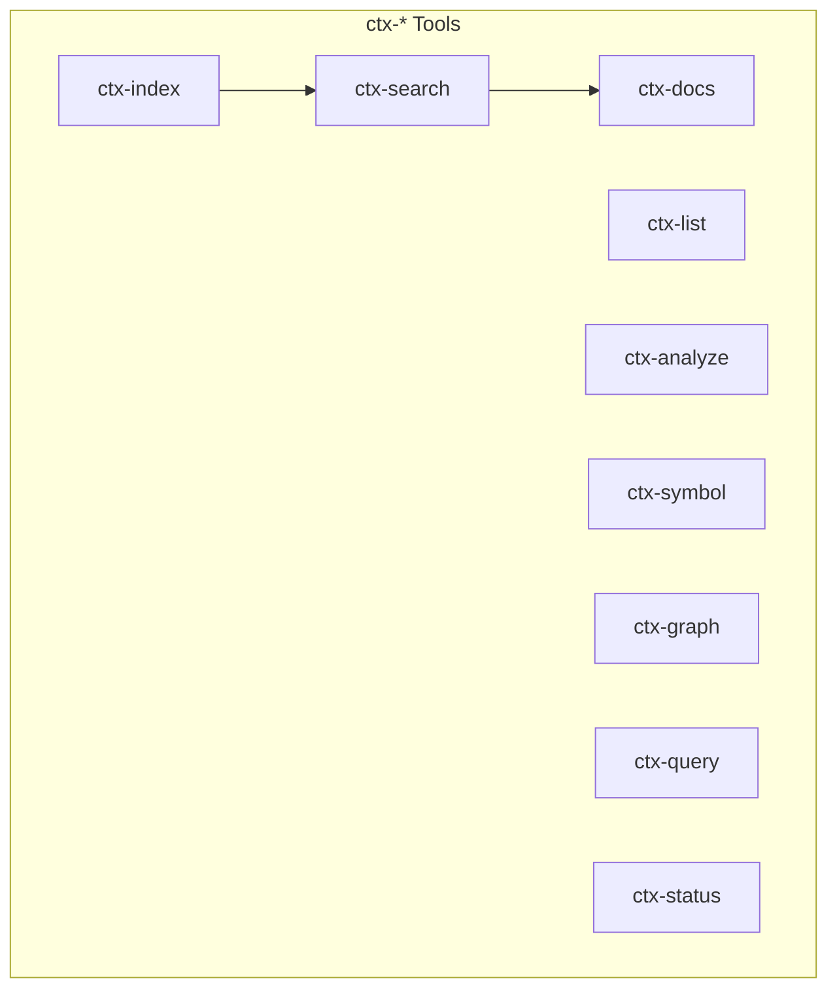

# repo-ctx User Guide

This guide covers installation, configuration, and usage of repo-ctx from a user perspective.

---

## Table of Contents

1. [Installation](#installation)
2. [Configuration](#configuration)
3. [CLI Usage](#cli-usage)
4. [MCP Server (AI Assistants)](#mcp-server-ai-assistants)
5. [Code Analysis](#code-analysis)
6. [Architecture Analysis](#architecture-analysis)
7. [CPG Analysis (Joern)](#cpg-analysis-joern)
8. [LLM Integration for Code Modernization](#llm-integration-for-code-modernization)
9. [Best Practices](#best-practices)
10. [Troubleshooting](#troubleshooting)

---

## Installation

### Basic Installation

```bash
pip install repo-ctx
```

Or use without installing:

```bash
uvx repo-ctx --help
```

### Verify Installation

```bash
repo-ctx --version
```

### Installing Joern (Recommended)

Joern enables advanced code analysis for all 12 supported languages. Without Joern, analysis falls back to tree-sitter (5 languages).

**Requirements:** Java 19+

**Linux/macOS:**

```bash
# 1. Install Java
# Ubuntu/Debian:
sudo apt install openjdk-21-jdk

# macOS:
brew install openjdk@21

# 2. Install Joern
curl -L "https://github.com/joernio/joern/releases/latest/download/joern-install.sh" | bash

# 3. Add to PATH (add to ~/.bashrc or ~/.zshrc)
export PATH="$HOME/bin/joern:$PATH"

# 4. Verify
joern --version
repo-ctx status
```

**Windows:**

1. Install Java 21 from https://adoptium.net/
2. Download Joern from https://github.com/joernio/joern/releases
3. Extract and add to PATH
4. Verify: `joern --version`

---

## Configuration

### No Configuration Required For

- Local Git repositories
- Public GitHub repositories (60 requests/hour rate limit)

### Environment Variables

```bash
# GitHub (private repos or higher rate limit)
export GITHUB_TOKEN="ghp_your_token"

# GitLab (required for any GitLab access)
export GITLAB_URL="https://gitlab.company.com"
export GITLAB_TOKEN="glpat-your_token"

# Optional: Custom database location
export STORAGE_PATH="~/.repo-ctx/context.db"
```

### Config File

Create `~/.config/repo-ctx/config.yaml`:

```yaml
github:
  token: "${GITHUB_TOKEN}"

gitlab:
  url: "https://gitlab.company.com"
  token: "${GITLAB_TOKEN}"

storage:
  path: "~/.repo-ctx/context.db"
```

### Configuration Priority

1. Command-line arguments (highest)
2. Environment variables
3. Config file
4. Defaults (lowest)

---

## CLI Usage

### Operating Modes

| Mode | Command | Description |
|------|---------|-------------|
| Batch | `repo-ctx <command>` | Direct command execution |
| Interactive | `repo-ctx -i` | Command palette UI |
| MCP Server | `repo-ctx -m` | For AI assistant integration |

### Global Options

```bash
-o, --output {text,json,yaml}   # Output format
-p, --provider {auto,github,gitlab,local}   # Provider selection
-v, --verbose                   # Verbose output
```

### Command Summary

| Command | Description |
|---------|-------------|
| `index` | Index a repository or organization |
| `list` | List indexed repositories |
| `search` | Search repos or symbols |
| `docs` | Get repository documentation |
| `analyze` | Analyze code and extract symbols |
| `graph` | Generate dependency graph |
| `dsm` | Generate Dependency Structure Matrix |
| `cycles` | Detect cyclic dependencies |
| `layers` | Detect architectural layers |
| `architecture` | Check architecture rules |
| `metrics` | Calculate XS complexity score |
| `dump` | Export repository analysis to .repo-ctx directory |
| `query` | Run CPGQL query (requires Joern) |
| `export` | Export CPG graphs (requires Joern) |
| `status` | Show system capabilities |

### Repository Commands

#### Index a Repository

```bash
# Local repository
repo-ctx index /path/to/repo
repo-ctx index ./relative/path
repo-ctx index ~/my-project

# GitHub repository
repo-ctx index owner/repo
repo-ctx index fastapi/fastapi --github

# GitLab repository
repo-ctx index group/project --gitlab
```

**Target auto-detection:**
| Format | Detected As |
|--------|-------------|
| `/owner/repo` | Indexed repository ID |
| `./path`, `../path`, `~/path` | Local filesystem path |
| `owner/repo` | Remote repository (GitHub/GitLab) |
| Absolute path that exists | Local filesystem path |

#### Index Organization/Group

```bash
# GitHub organization
repo-ctx index --group microsoft --github

# GitLab group (includes subgroups by default)
repo-ctx index --group mycompany --gitlab
```

#### Search Repositories

```bash
# Fuzzy search indexed repos (typo-tolerant)
repo-ctx search "fastapi"
repo-ctx search "fasapi"  # Still finds "fastapi"

# Exact match
repo-ctx search "fastapi" --exact

# Limit results
repo-ctx search "api" -n 20
```

#### Search Symbols in Code

```bash
# Search symbols in local path
repo-ctx search "UserService" --symbols ./src

# Filter by symbol type
repo-ctx search "User" --symbols ./src --type class

# Search in indexed repository
repo-ctx search "endpoint" --symbols /fastapi/fastapi
```

#### List Indexed Repositories

```bash
repo-ctx list
repo-ctx list --github
repo-ctx list --gitlab
```

#### Get Documentation

```bash
# Basic retrieval
repo-ctx docs /owner/repo

# Filter by topic
repo-ctx docs /owner/repo --topic api

# Limit tokens (recommended for AI usage)
repo-ctx docs /owner/repo --max-tokens 8000

# Include code analysis
repo-ctx docs /owner/repo --include code,diagrams

# LLMs.txt format (compact)
repo-ctx docs /owner/repo --format llmstxt

# Specific version
repo-ctx docs /owner/repo/v1.0.0
```

**Include Options:**

| Option | Description |
|--------|-------------|
| `code` | Code structure (classes, functions) |
| `symbols` | Detailed symbol information |
| `diagrams` | Mermaid diagrams |
| `tests` | Include test files |
| `examples` | All code examples |
| `all` | Enable all options |

---

## MCP Server (AI Assistants)

### Setup

Add to your MCP configuration (e.g., `~/.config/claude/mcp.json`):

```json
{
  "mcpServers": {
    "repo-ctx": {
      "command": "uvx",
      "args": ["repo-ctx", "-m"],
      "env": {
        "GITHUB_TOKEN": "${GITHUB_TOKEN}",
        "GITLAB_URL": "${GITLAB_URL}",
        "GITLAB_TOKEN": "${GITLAB_TOKEN}"
      }
    }
  }
}
```

**Minimal setup** (local + public GitHub only):

```json
{
  "mcpServers": {
    "repo-ctx": {
      "command": "uvx",
      "args": ["repo-ctx", "-m"]
    }
  }
}
```

### Available MCP Tools

repo-ctx provides 18 MCP tools with the `ctx-` prefix.



| Category | Tools |
|----------|-------|
| Repository | `ctx-index`, `ctx-list`, `ctx-search`, `ctx-docs` |
| Code Analysis | `ctx-analyze`, `ctx-symbol`, `ctx-symbols`, `ctx-graph` |
| Architecture | `ctx-dsm`, `ctx-cycles`, `ctx-layers`, `ctx-architecture`, `ctx-metrics` |
| Export | `ctx-llmstxt`, `ctx-dump` |
| CPG (Joern) | `ctx-query`, `ctx-export`, `ctx-status` |

### MCP Tool Examples

```javascript
// Index and search
await mcp.call("ctx-index", { target: "fastapi/fastapi" });
await mcp.call("ctx-search", { query: "authentication" });
await mcp.call("ctx-docs", {
  repository: "/fastapi/fastapi",
  max_tokens: 10000,
  include: ["code", "diagrams"]
});
await mcp.call("ctx-analyze", { target: "./src", language: "python" });

```

For complete MCP documentation, see [MCP Tools Reference](mcp_tools_reference.md).

---

## Code Analysis

### Analyze Code Structure

```bash
# Analyze directory
repo-ctx analyze ./src

# Filter by language
repo-ctx analyze ./src --lang python

# Filter by symbol type
repo-ctx analyze ./src --type class

# Exclude private symbols
repo-ctx analyze ./src --no-private

# JSON output
repo-ctx analyze ./src -o json
```

### Search for Symbols

```bash
# Search symbols in local code
repo-ctx search "User" --symbols ./src
repo-ctx search "Service" --symbols ./src --type class
```

### Generate Dependency Graph

```bash
# Class dependency graph (default)
repo-ctx graph ./src

# Different graph types
repo-ctx graph ./src --type class
repo-ctx graph ./src --type function
repo-ctx graph ./src --type file

# Output formats
repo-ctx graph ./src --format json
repo-ctx graph ./src --format dot
repo-ctx graph ./src --format graphml
```

### Verifying and Visualizing Analysis

The enhanced analysis provides deeper insights into your code. Here's how to see the results.

#### Verification

Use the `analyze` command with `--output json` to see docstrings and data flow dependencies.

**Example:**

Given a file `sample_code.py`:
```python
"""
This is a sample file for testing code analysis.
"""

def get_user_data(user_id: int) -> dict:
    """
    Retrieves user data from a database.
    """
    db_data = {"id": user_id, "name": "Test User"}
    return process_data(db_data)

def process_data(data: dict) -> dict:
    """
    Processes raw data.
    """
    data["processed"] = True
    return data
```

**Command:**
```bash
repo-ctx analyze sample_code.py --output json
```

**What to look for in the output:**
- **`documentation`**: The `symbols` array will have a `documentation` field with the docstring.
- **`dependencies`**: You'll see a new dependency with `"dependency_type": "data_flow"`.

#### Visualization

1.  **High-Level Dependency Graph:**

    The `graph` command now visualizes data flows as dashed orange arrows.

    ```bash
    # Generate a .dot file for a function graph
    repo-ctx graph sample_code.py --type function --format dot > function_graph.dot

    # Render the graph to an image (requires Graphviz)
    dot -Tpng function_graph.dot -o function_graph.png
    ```

2.  **Deep CPG Visualization:**

    For a very detailed view, export the entire Code Property Graph from Joern.

    ```bash
    # Export the CPG to .dot files
    repo-ctx export sample_code.py . --format dot

    # Render the main CPG graph
    dot -Tpng CPG.dot -o cpg_full.png
    ```

---

## Architecture Analysis

repo-ctx provides architecture analysis to detect complexity, cycles, and enforce architectural boundaries. For detailed algorithms and examples, see [Architecture Analysis Guide](architecture_analysis_guide.md).

### Quick Overview

| Command | Purpose |
|---------|---------|
| `dsm` | Dependency Structure Matrix - visualize dependencies |
| `cycles` | Detect cyclic dependencies with breakup suggestions |
| `layers` | Automatically detect architectural layers |
| `architecture` | Check architecture rules and find violations |
| `metrics` | Calculate XS (complexity) score and find hotspots |

### Dependency Structure Matrix (DSM)

```bash
# Generate DSM for class dependencies
repo-ctx dsm ./src --type class

# Module-level DSM
repo-ctx dsm ./src --type module

# JSON output
repo-ctx dsm ./src -f json
```

A **triangular DSM** indicates clean layered architecture (no cycles).

### Cycle Detection

```bash
# Find cycles with breakup suggestions
repo-ctx cycles ./src --type class
```

Output includes which edges to remove to break cycles with minimal impact.

### Layer Detection

```bash
# Automatically detect layers
repo-ctx layers ./src

# Output shows layers from top (consumers) to bottom (providers)
```

### Architecture Rules

Define rules in YAML to enforce architectural boundaries:

```yaml
# architecture.yaml
name: "Clean Architecture"

layers:
  - name: ui
    patterns: ["*.controller.*", "*.view.*"]
    above: domain
  - name: domain
    patterns: ["*.service.*"]
    above: data
  - name: data
    patterns: ["*.repository.*"]

forbidden:
  - from: "*.data.*"
    to: "*.ui.*"
    reason: "Data layer cannot depend on UI"
```

Check rules:

```bash
repo-ctx architecture ./src --rules architecture.yaml
```

### Structural Metrics (XS)

Calculate **XS (eXcess Structural complexity)** score:

```bash
# Basic metrics
repo-ctx metrics ./src

# Include violations in score
repo-ctx metrics ./src --rules architecture.yaml
```

**Output:**

```
Structural Metrics: ./src

Grade: B - Good - Well-structured with some areas for improvement
XS Score: 35.5

Nodes: 42 | Edges: 68
Cycles: 2 | Violations: 0

Score Breakdown:
  Cycles:       30.0
  Coupling:      5.5
  Size:          0.0
  Violations:    0.0

Hotspots (3):
  ServiceManager (cycle_participant) - severity: 5.0
  DataAccess (high_coupling) - severity: 4.5
```

**Grade Scale:**

| Grade | XS Score | Meaning |
|-------|----------|---------|
| A | 0-20 | Excellent |
| B | 20-40 | Good |
| C | 40-60 | Moderate issues |
| D | 60-80 | Poor |
| F | 80+ | Critical |

### Dump Repository Analysis

Export complete repository analysis to a `.repo-ctx` directory for offline access, version control, or sharing.

```bash
# Basic dump (medium level)
repo-ctx dump ./my-project

# Full analysis with all details
repo-ctx dump ./my-project --level full

# Compact summary only
repo-ctx dump ./my-project --level compact

# Force overwrite existing
repo-ctx dump ./my-project --force

# Include private symbols
repo-ctx dump ./my-project --include-private

# Generate LLM-powered business summary
repo-ctx dump ./my-project --llm

# Exclude patterns
repo-ctx dump ./my-project --exclude 'tests/*' --exclude 'docs/*'

# Persist to Neo4j graph database
repo-ctx dump ./my-project --persist-graph

# Generate hierarchical documentation with LLM enhancement
repo-ctx dump ./my-project --llm-enhance
```

**Levels:**

| Level | Contents |
|-------|----------|
| `compact` | llms.txt, metadata.json, symbols/index.json |
| `medium` | + docs/, metrics/, architecture/ |
| `full` | + symbols/by-file/, detailed analysis |

**Graph Persistence (`--persist-graph`):**

When `--persist-graph` is specified, the analysis is also stored in the configured graph database (Neo4j or in-memory NetworkX):
- Symbols become graph nodes with labels (Class, Function, PublicAPI)
- Dependencies become relationships (CALLS, IMPORTS)
- Enables Cypher queries for impact analysis and visualization

Configure Neo4j connection:
```bash
export NEO4J_URI=bolt://localhost:7687
export NEO4J_USERNAME=neo4j
export NEO4J_PASSWORD=your-password
```

**LLM Enhancement (`--llm-enhance`):**

When `--llm-enhance` is specified, the dump command generates a hierarchical representation of the codebase with LLM-enhanced documentation:

- **Symbol Enhancement**: Each symbol is enhanced with LLM-generated explanations
- **File Documentation**: Each source file gets a summary of its purpose
- **Business Summary**: Generates `CODEBASE_SUMMARY.md` with executive summary, key capabilities, target users, and business value
- **Parallel Processing**: Files are processed in parallel for faster enhancement
- **Automatic Retry**: Empty LLM responses are retried up to 3 times

**Options:**

| Option | Description |
|--------|-------------|
| `--llm-enhance` | Enable LLM enhancement for all symbols |
| `--llm-concurrency N` | Number of parallel LLM requests (default: 5) |
| `--llm-model MODEL` | LLM model to use (e.g., `gpt-4o-mini`, `claude-sonnet-4-20250514`) |

**Examples:**

```bash
# Basic LLM enhancement with default concurrency (5)
repo-ctx dump ./my-project --llm-enhance

# Faster processing with higher concurrency
repo-ctx dump ./my-project --llm-enhance --llm-concurrency 10

# Use a specific model
repo-ctx dump ./my-project --llm-enhance --llm-model gpt-4o-mini

# Exclude tests and examples
repo-ctx dump ./my-project --llm-enhance --exclude 'tests/*' --exclude 'examples/*'
```

**Output structure with `--llm-enhance`:**

```
.repo-ctx/
├── llms.txt              # LLM-optimized summary (includes business summary)
├── ARCHITECTURE_SUMMARY.md # Architecture overview with diagrams
├── metadata.json         # Generation metadata
├── symbols/
│   ├── index.json        # All symbols with documentation
│   └── by-file/          # Per-file symbol documentation (FULL level)
│       ├── src_main.py.json
│       └── ...
├── architecture/
│   ├── dependencies.html # Interactive graph (open in browser)
│   ├── dependencies.dot  # GraphViz format
│   ├── dependencies.mmd  # Mermaid format
│   ├── layers.json       # Topological layers
│   ├── cycles.json       # Detected cycles
│   └── ...
└── metrics/
    └── complexity.json   # Code complexity metrics
```

**Interactive Dependency Graph:**

The `dependencies.html` file provides a vis.js-powered interactive graph with:
- **Search** - Find nodes by name
- **Filter** - Show all nodes, high-connectivity nodes only, or cycle participants
- **Layout switching** - Force-directed or hierarchical layouts
- **Node details** - Click any node to see its connections
- **Zoom and pan** - Navigate large graphs easily

Open it directly in your browser:
```bash
open .repo-ctx/architecture/dependencies.html
# or on Linux:
xdg-open .repo-ctx/architecture/dependencies.html
```

**Business Summary (in llms.txt):**

When using `--llm-enhance`, the business summary is integrated into `llms.txt` and includes:
1. **Executive Summary** - What the software does and who benefits
2. **Key Capabilities** - Main features and what they enable
3. **Target Users** - Primary users and their workflows
4. **Business Value** - Time savings and competitive advantages
5. **Integration & Ecosystem** - What it connects with
6. **Maturity & Scope** - Type of software and limitations

**Retry Behavior:**

If the LLM returns an empty response (e.g., due to rate limits), the system automatically retries:
- Up to 3 attempts per file/summary
- 1 second delay between retries
- Logs retry attempts for debugging

Combine with `--llm` flag for additional LLM-powered summaries:
```bash
# Full LLM enhancement with business summary
repo-ctx dump ./my-project --llm --llm-enhance
```

### MCP Tools for Architecture

```javascript
// DSM
await mcp.call("ctx-dsm", { path: "./src", graphType: "class" });

// Cycles
await mcp.call("ctx-cycles", { path: "./src" });

// Layers
await mcp.call("ctx-layers", { path: "./src" });

// Architecture rules
await mcp.call("ctx-architecture", {
  path: "./src",
  rulesYaml: "layers:\n  - name: ui\n    above: data"
});

// Metrics
await mcp.call("ctx-metrics", { path: "./src" });
```

---

## CPG Analysis (Joern)

Joern provides Code Property Graph analysis with CPGQL queries. Check availability:

```bash
repo-ctx status
```

### Run CPGQL Queries

```bash
# List all methods
repo-ctx query ./src "cpg.method.name.l"

# List all types/classes
repo-ctx query ./src "cpg.typeDecl.name.l"

# Find function calls
repo-ctx query ./src "cpg.call.name.l"

# Find specific patterns (security auditing)
repo-ctx query ./src 'cpg.call.name("exec").l'
```

### Common CPGQL Queries

| Query | Description |
|-------|-------------|
| `cpg.method.name.l` | List method names |
| `cpg.typeDecl.name.l` | List class/type names |
| `cpg.call.name.l` | List function calls |
| `cpg.method.callOut.name.l` | Methods and what they call |
| `cpg.call.name("exec.*").l` | Find exec-like calls |

### Export Graphs

```bash
# Export all graph representations
repo-ctx export ./src ./output

# Export specific representation
repo-ctx export ./src ./output --repr cfg   # Control Flow
repo-ctx export ./src ./output --repr ast   # Syntax Tree
repo-ctx export ./src ./output --repr ddg   # Data Dependency

# Output formats
repo-ctx export ./src ./output --format dot
repo-ctx export ./src ./output --format graphml
repo-ctx export ./src ./output --format neo4jcsv
```

**Graph Representations:**

| Representation | Description |
|----------------|-------------|
| `all` | All graphs (default) |
| `ast` | Abstract Syntax Tree |
| `cfg` | Control Flow Graph |
| `cdg` | Control Dependency Graph |
| `ddg` | Data Dependency Graph |
| `pdg` | Program Dependency Graph |
| `cpg14` | Full CPG |

---

## LLM Integration for Code Modernization

repo-ctx's MCP tools enable LLMs to perform data-driven code analysis and modernization. For detailed patterns and workflows, see [Architecture Analysis Guide - LLM Integration](architecture_analysis_guide.md#llm-integration-for-software-modernization).

### Quick Start

Configure your MCP client and use these patterns:

```javascript
// Architecture assessment
const metrics = await mcp.call("ctx-metrics", { path: "./src" });
const cycles = await mcp.call("ctx-cycles", { path: "./src" });
const layers = await mcp.call("ctx-layers", { path: "./src" });

// LLM synthesizes findings into actionable report
```

### Common Modernization Scenarios

| Scenario | MCP Tools to Use |
|----------|------------------|
| **Architecture health check** | `metrics` → `cycles` → `layers` |
| **Microservice extraction** | `cycles` → `dsm` → `analyze` → `graph` |
| **Technical debt reduction** | `metrics` → `cycles` → `architecture` |
| **Legacy code understanding** | `layers` → `docs` → `analyze` → `dsm` |
| **PR architecture review** | `architecture` → `cycles` → `metrics` |

### Example: Modernization Assessment

```
Prompt to LLM:

Analyze this codebase for modernization:
1. Run ctx-metrics to get XS score
2. Run ctx-cycles to find circular dependencies
3. Run ctx-layers to understand structure

Create a report with:
- Overall health grade
- Top 3 blocking issues
- Prioritized refactoring recommendations
```

### Example: Pre-PR Check

```
Prompt to LLM:

Before merging this PR, check for issues:
1. Run ctx-architecture with our rules
2. Run ctx-cycles to ensure no new cycles
3. Compare metrics to baseline

Flag anything that would fail architecture checks.
```

### Best Practices

1. **Use JSON output** - Request `outputFormat: "json"` for structured processing
2. **Limit tokens** - Use `max_tokens` for large codebases
3. **Chain logically** - metrics → cycles → architecture (progressive detail)
4. **Cache results** - Store analysis in context for multi-turn conversations
5. **Combine with CPGQL** - Use `ctx-query` for deep data flow analysis

---

## Best Practices

### 1. Index Before Searching

Always index repositories before searching or retrieving documentation:

```bash
repo-ctx index owner/repo
repo-ctx search "query"
```

### 2. Use Token Limits for AI

When retrieving documentation for AI assistants, use `--max-tokens`:

```bash
repo-ctx docs /owner/repo --max-tokens 8000
```

### 3. Specify Provider for Ambiguous Paths

When the path format is ambiguous, specify the provider explicitly:

```bash
# Two-part paths default to GitHub
repo-ctx index group/project --gitlab
```

### 4. Use Specific Versions for Stability

Reference specific versions for stable documentation:

```bash
repo-ctx docs /owner/repo/v1.0.0
```

### 5. Use Joern for Security Auditing

Joern CPGQL enables security-focused queries:

```bash
# Find command injection vectors
repo-ctx query ./src 'cpg.call.name("system|exec|popen").l'

# Find SQL injection vectors
repo-ctx query ./src 'cpg.call.name("execute").argument.l'
```

### 6. Repository Configuration

Add `.repo-ctx.json` to your repository for custom indexing:

```json
{
  "description": "Custom description",
  "folders": ["docs/", "guides/"],
  "exclude_folders": ["docs/internal/"],
  "exclude_files": ["CHANGELOG.md"]
}
```

---

## Troubleshooting

### "Provider 'gitlab' not configured"

GitLab requires configuration:

```bash
export GITLAB_URL="https://gitlab.company.com"
export GITLAB_TOKEN="glpat-your_token"
```

### "Rate limit exceeded" (GitHub)

Configure authentication for higher limits:

```bash
export GITHUB_TOKEN="ghp_your_token"  # 5000 req/hour vs 60
```

### "Repository not found"

- Check path format matches provider
- Verify token permissions
- For local repos, ensure `.git` directory exists

### "No results found"

Index the repository first:

```bash
repo-ctx index owner/repo
repo-ctx list  # Verify indexing
```

### "Joern is not available"

Install Joern following the installation instructions above, then verify:

```bash
joern --version
repo-ctx status
```

### Reset Database

```bash
rm ~/.repo-ctx/context.db
```

---

## Further Reading

- [Developer Guide](dev_guide.md) - Architecture and internals
- [Architecture Analysis Guide](architecture_analysis_guide.md) - DSM, cycles, layers, rules, XS metrics
- [MCP Tools Reference](mcp_tools_reference.md) - Complete MCP documentation
- [Multi-Provider Guide](multi-provider-guide.md) - Provider configuration details
